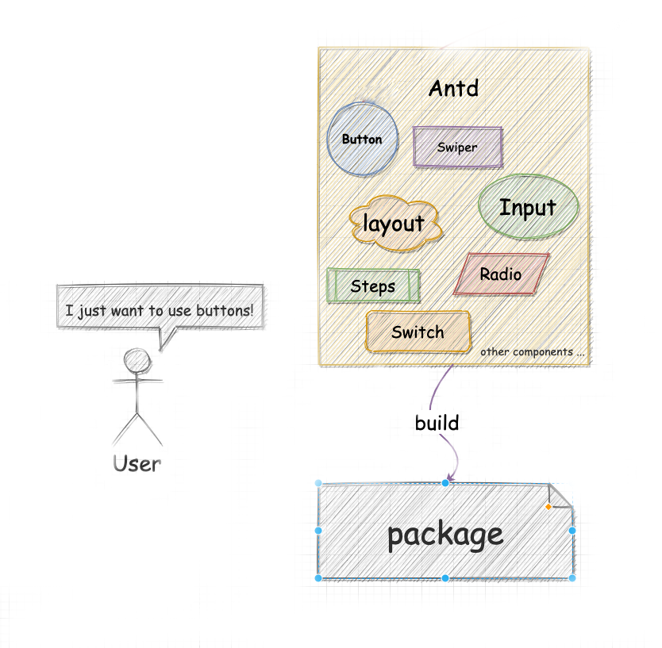
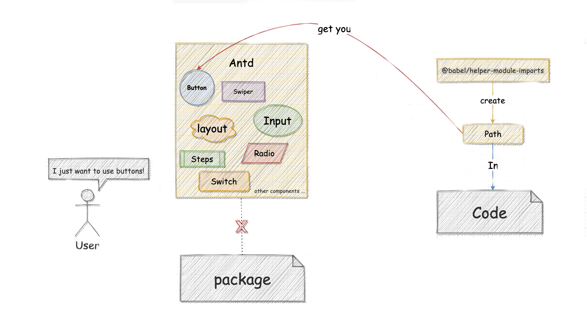

# 庖丁解牛：最全babel-plugin-import源码详解
> 序言：在[用 babel-plugin 实现按需加载](https://zhuanlan.zhihu.com/p/210280253)一文中笔者用作用域链思路实现了按需加载组件。此思路是统一式处理，进入`ImportDeclaration`后，收集依赖，生成新节点，最后利用**作用域(scope)链**直接替换了被修改的`specifiers[]`绑定的所有引用名。同样是利用作用域链，可以知晓某一节点是否在上下文中被引用，如果没有引用就删除无效节点。乃至最后的替换原节点完成按需加载。这次本文将带领大家解析 `babel-plugin-import` 实现按需加载的完整流程，解开业界所认可 babel 插件的面纱。

首先供上`babel-plugin-import`插件地址：[ant-design/babel-plugin-import](https://github.com/ant-design/babel-plugin-import)


由于在笔者的上一篇文章中已经对 babel 与 babel-plugin 有过介绍了，因此本文不再赘述，直接进入正题。想了解的同学详情可点击[此链接](https://zhuanlan.zhihu.com/p/210280253)。
众所周知，庖丁解牛分为三个阶段：

- 第一阶段，庖丁刚开始宰牛的时候，对于牛体的结构还不了解，看见的只是整头的牛。
- 第二阶段，三年之后，他见到的是牛的内部肌理筋骨，再也看不见整头的牛了。
- 第三阶段，现在宰牛的时候，只是用精神去接触牛的身体就可以了，而不必用眼睛去看。

现在就以这三个阶段去逐步递进 `babel-plugin-import` 插件源码

## Step1: 始臣之解牛之时,所见无非牛者


首先 `babel-plugin-import` 是为了解决在打包过程中把项目中引用到的外部组件或功能库全量打包，从而导致编译结束后包容量过大的问题，如下图所示：

`babel-plugin-import` 插件源码由两个文件构成

- Index 文件即是插件入口初始化的文件，也是笔者在Step1 中着重说明的文件
- Plugin 文件包含了处理各种AST节点的方法集，以Class形式导出

先来到插件的入口文件Index：
```javascript
import Plugin from './Plugin';
export default function({ types }) {
  let plugins = null;
  /**
   * Program入口初始化插件options的数据结构
   */
  const Program = {
    enter(path, { opts = {} }) {
      assert(opts.libraryName, 'libraryName should be provided');
      plugins = [
        new Plugin(
          opts.libraryName,
          opts.libraryDirectory,
          opts.style,
          opts.styleLibraryDirectory,
          opts.customStyleName,
          opts.camel2DashComponentName,
          opts.camel2UnderlineComponentName,
          opts.fileName,
          opts.customName,
          opts.transformToDefaultImport,
          types,
        ),
      ];
      applyInstance('ProgramEnter', arguments, this);
    },
    exit() {
      applyInstance('ProgramExit', arguments, this);
    },
  };
  const ret = {
    visitor: { Program }, //对整棵AST树的入口进行初始化操作
  };
  return ret;
}
```
首先Index文件导入了Plugin，并且有一个默认导出函数，函数的参数是被解构出的名叫 **types** 的参数，它是从babel对象中被解构出来的，types的全称是 `@babel/types`，用于处理AST节点的方法集。以这种方式引入后，我们不需要手动引入 `@babel/types`
进入函数后可以看见`观察者(visitor)` 中初始化了一个AST节点 `Program`，这里对 `Program` 节点的处理使用完整插件结构，有进入(enter)与离开（exit）事件，且需注意：
> 一般我们缩写的 Identifier() { ... } 是 Identifier: { enter() { ... } } 的简写形式。

这里可能有同学会问 `Program` 节点是什么？见下方 const a = 1 对应的AST树 ( 简略部分参数 )
```json
{
  "type": "File",
  "loc": {
    "start":... ,
    "end": ...
  },
  "program": {
    "type": "Program", // Program所在位置
    "sourceType": "module",
    "body": [
      {
        "type": "VariableDeclaration",
        "declarations": [
          {
            "type": "VariableDeclarator",
            "id": {
              "type": "Identifier",
              "name": "a"
            },
            "init": {
              "type": "NumericLiteral",
              "value": 1
            }
          }
        ],
        "kind": "const"
      }
    ],
    "directives": []
  },
  "comments": [],
  "tokens": [
       ...
  ]
}
```
Program 相当于一个**根节点**，一个完整的源代码树。一般在进入该节点的时候进行初始化数据之类的操作，也可理解为该节点先于其他节点执行，同时也是最晚执行 exit 的节点，在 exit 时也可以做一些”善后“的工作。 既然 `babel-plugin-import` 的 `Program` 节点处写了完整的结构，必然在 exit 时也有非常必要的事情需要处理，关于exit具体是做什么的我们稍后进行讨论。
我们先看 enter ，这里首先用 enter 形参 state 结构出用户制定的插件参数，验证必填的 `libraryName` [库名称] 是否存在。Index文件引入的 Plugin 是一个 class 结构，因此需要对 Plugin 进行实例化，并把插件的所有参数与`@babel/types` 全部传进去，关于Plugin类会在下文中进行阐述。
接着调用了 `applyInstance` 函数：
```javascript
export default function({ types }) {
  let plugins = null;
  /**
   * 从类中继承方法并利用apply改变this指向，并传递path,state参数
   */
  function applyInstance(method, args, context) {
    for (const plugin of plugins) {
      if (plugin[method]) {
        plugin[method].apply(plugin, [...args, context]);
      }
    }
  }
  const Program = {
    enter(path, { opts = {} }) {
      ...
      applyInstance('ProgramEnter', arguments, this);
    },
      ...
   }
}
```
此函数的主要目的是继承 Plugin 类中的方法，且需要三个参数

1. method：String：你需要从Plugin类中继承出来的方法名称
1. args: Arrray<T>：[ Path, State ]
1. PluginPass: Object：内容和 State 一致，确保传递内容为最新的 State

主要的目的是让 `Program` 的 enter 继承 Plugin 类的 `ProgramEnter` 方法，并且传递 path 与 state 形参至 `ProgramEnter` 。`Program` 的 exit 同理，继承的是 `ProgramExit` 方法。


现在进入Plugin类：
```javascript
export default class Plugin {
  constructor(
    libraryName,
    libraryDirectory,
    style,
    styleLibraryDirectory,
    customStyleName,
    camel2DashComponentName,
    camel2UnderlineComponentName,
    fileName,
    customName,
    transformToDefaultImport,
    types, // babel-types
    index = 0, // 标记符
  ) {
    this.libraryName = libraryName; // 库名
    this.libraryDirectory = typeof libraryDirectory === 'undefined' ? 'lib' : libraryDirectory; // 包路径
    this.style = style || false; // 是否加载style
    this.styleLibraryDirectory = styleLibraryDirectory; // style包路径
    this.camel2DashComponentName = camel2DashComponentName || true; // 组件名是否转换以“-”链接的形式
    this.transformToDefaultImport = transformToDefaultImport || true; // 处理默认导入
    this.customName = normalizeCustomName(customName); // 处理转换结果的函数或路径
    this.customStyleName = normalizeCustomName(customStyleName); // 处理转换结果的函数或路径
    this.camel2UnderlineComponentName = camel2UnderlineComponentName; // 处理成类似time_picker的形式
    this.fileName = fileName || ''; // 链接到具体的文件，例如antd/lib/button/[abc.js]
    this.types = types; // babel-types
    this.pluginStateKey = `importPluginState${index}`;
  }
  ...
}
```
在入口文件实例化 Plugin 已经把插件的参数通过 `constructor` 后被初始化完毕啦，除了 `libraryName` 以外其他所有的值均有相应默认值，值得注意的是参数列表中的 **customeName **与 **customStyleName **可以接收一个函数或者一个引入的路径，因此需要通过 `normalizeCustomName` 函数进行统一化处理。
```javascript
function normalizeCustomName(originCustomName) {
  if (typeof originCustomName === 'string') {
    const customeNameExports = require(originCustomName);
    return typeof customeNameExports === 'function'
      ? customeNameExports
      : customeNameExports.default;// 如果customeNameExports不是函数就导入{default:func()}
  }
  return originCustomName;
}
```
此函数就是用来处理当参数是路径时，进行转换并取出相应的函数。如果处理后 `customeNameExports` 仍然不是函数就导入 `customeNameExports.default` ，这里牵扯到export default是语法糖的一个小知识点。
```javascript
export default something() {}
// 等效于
function something() {}
export ( something as default )

```
回归代码，Step1中入口文件 `Program` 的 Enter 继承了 Plugin 的 `ProgramEnter` 方法
```javascript
export default class Plugin {
  constructor(...) {...}
 
  getPluginState(state) {
    if (!state[this.pluginStateKey]) {
      // eslint-disable-next-line no-param-reassign
      state[this.pluginStateKey] = {}; // 初始化标示
    }
    return state[this.pluginStateKey]; // 返回标示
  }
  ProgramEnter(_, state) {
    const pluginState = this.getPluginState(state);
    pluginState.specified = Object.create(null); // 导入对象集合
    pluginState.libraryObjs = Object.create(null); // 库对象集合 (非module导入的内容)
    pluginState.selectedMethods = Object.create(null); // 存放经过 importMethod 之后的节点
    pluginState.pathsToRemove = []; // 存储需要删除的节点
    /**
     * 初始化之后的state
     * state:{
     *    importPluginState「Number」: {
     *      specified:{},
     *      libraryObjs:{},
     *      select:{},
     *      pathToRemovw:[]
     *    },
     *    opts:{
     *      ...
     *    },
     *    ...
     * }
     */
  }
   ...
}
```
`ProgramEnter` 中通过 `getPluginState`** **初始化 state 结构中的 `importPluginState` 对象，`getPluginState`** **函数在后续操作中出现非常频繁，读者在此需要留意此函数的作用，后文不再对此进行赘述。
但是为什么需要初始化这么一个结构呢？这就牵扯到插件的思路。正像开篇流程图所述的那样 `babel-plugin-import`** **具体实现按需加载思路是：
**经过import节点后收集节点数据，然后从所有可能引用到import绑定的节点处执行按需加载转换方法。state是一个引用类型，对其进行操作会影响到后续节点的state初始值，因此用Program节点，在enter的时候就初始化这个收集依赖的对象，方便后续操作。负责初始化state节点结构与取数据的方法正是 **`getPluginState`。
这个思路很重要，并且贯穿后面所有的代码与目的，请读者务必理解再往下阅读。

## Step2: 三年之后,未尝见全牛也


借由 Step1，现在已经了解到插件以 `Program` 为出发点继承了 `ProgramEnter` 并且初始化了 Plugin 依赖，如果读者还有尚未梳理清楚的部分，请回到 Step1 仔细消化下内容再继续阅读。
首先，我们再回到外围的 Index 文件，之前只在观察者模式中注册了 `Program` 的节点，没有其他AST节点入口，因此至少还需注入 import 语句的AST节点类型 `ImportDeclaration`
```javascript
export default function({ types }) {
  let plugins = null;
  function applyInstance(method, args, context) {
      ...
  }
  const Program = {
      ...
   }
  const methods = [ // 注册 AST type 的数组
    'ImportDeclaration' 
  ]
  
  const ret = {
    visitor: { Program }, 
  };
  
  // 遍历数组，利用applyInstance继承相应方法
  for (const method of methods) { 
    ret.visitor[method] = function() {
      applyInstance(method, arguments, ret.visitor);
    };
  }
   
}
```
创建一个数组并将 `ImportDeclaration` 置入，经过遍历调用 `applyInstance`_  _和 Step1 介绍同理，执行完毕后visitor会变成如下结构
```json
visitor: {
  Program: { enter: [Function: enter], exit: [Function: exit] },
  ImportDeclaration: [Function],
}
```
现在回归Plugin，进入 `ImportDeclaration`
```javascript
export default class Plugin {
  constructor(...) {...}
  ProgramEnter(_, state) { ... }
  
  /**
   * 主目标，收集依赖
   */
  ImportDeclaration(path, state) {
    const { node } = path;
    // path 有可能被前一个实例删除
    if (!node) return;
    const {
      source: { value }, // 获取AST中引入的库名
    } = node;
    const { libraryName, types } = this;
    const pluginState = this.getPluginState(state); // 获取在Program处初始化的结构
    if (value === libraryName) { // AST库名与插件参数名是否一致，一致就进行依赖收集
      node.specifiers.forEach(spec => {
        if (types.isImportSpecifier(spec)) { // 不满足条件说明import是名称空间引入或默认引入
          pluginState.specified[spec.local.name] = spec.imported.name; 
          // 保存为：{ 别名 :  组件名 } 结构
        } else {
          pluginState.libraryObjs[spec.local.name] = true;// 名称空间引入或默认引入的值设置为true
        }
      });
      pluginState.pathsToRemove.push(path); // 取值完毕的节点添加进预删除数组
    }
  }
  ...
}
```
`ImportDeclaration` 会对 import 中的依赖字段进行收集，如果是名称空间引入或者是默认引入就设置为 { 别名 ：true }，解构导入就设置为 { 别名 ：组件名 } 。`getPluginState` 方法在Step1中已经进行过说明。关于 import 的AST节点结构 [用 babel-plugin 实现按需加载](https://zhuanlan.zhihu.com/p/210280253) 中有详细说明，本文不再赘述。执行完毕后pluginState结构如下
```json
// 例： import { Input, Button as Btn } from 'antd'

{
  ...
  importPluginState0: {
     specified: {
      Btn : 'Button',
      Input : 'Input'
    },
    pathToRemove: {
      [NodePath]
    }
    ...
  }
  ...
}
```
这下 `state.importPluginState` 结构已经收集到了后续帮助节点进行转换的所有依赖信息。
目前已经万事俱备，只欠东风。东风是啥？是能让转换 import 工作开始的 action。在 [用 babel-plugin 实现按需加载](https://zhuanlan.zhihu.com/p/210280253) 中收集到依赖的同时也进行了节点转换与删除旧节点。一切工作都在 `ImportDeclaration` 节点中发生。而 `babel-plugin-import` 的思路是**寻找一切可能引用到Import的AST节点，对他们全部进行处理。**
有部分读者也许会直接想到去转换引用了import**绑定**的JSX节点，但是转换JSX节点的意义不大，因为可能引用到import绑定的AST节点类型 ( type ) 已经够多了，所有应尽可能的缩小需要转换的AST节点类型范围。而且babel的其他插件会将我们的JSX节点进行转换成其他AST type，因此能不考虑JSX类型的AST树，可以等其他babel插件转换后再进行替换工作。其实下一步可以开始的入口有很多，但还是从咱最熟悉的 React.createElement 开始。
```javascript
class Hello extends React.Component {
    render() {
        return <div>Hello</div>
    }
}

// 转换后

class Hello extends React.Component {
    render(){
        return React.createElement("div",null,"Hello")
    }
}
```
JSX转换后AST类型为 `CallExpression`（函数执行表达式），结构如下所示，熟悉结构后能方便各位同学对之后步骤有更深入的理解。
```json
{
  "type": "File",
  "program": {
    "type": "Program",
    "body": [
      {
        "type": "ClassDeclaration",
        "body": {
          "type": "ClassBody",
          "body": [
            {
              "type": "ClassMethod",
              "body": {
                "type": "BlockStatement",
                "body": [
                  {
                    "type": "ReturnStatement",
                    "argument": {
                      "type": "CallExpression", // 这里是处理的起点
                      "callee": {
                        "type": "MemberExpression",
                        "object": {
                          "type": "Identifier",
                          "identifierName": "React"
                        },
                        "name": "React"
                      },
                      "property": {
                        "type": "Identifier",
                        "loc": {
                          "identifierName": "createElement"
                        },
                        "name": "createElement"
                      }
                    },
                    "arguments": [
                      {
                        "type": "StringLiteral",
                        "extra": {
                          "rawValue": "div",
                          "raw": "\"div\""
                        },
                        "value": "div"
                      },
                      {
                        "type": "NullLiteral"
                      },
                      {
                        "type": "StringLiteral",
                        "extra": {
                          "rawValue": "Hello",
                          "raw": "\"Hello\""
                        },
                        "value": "Hello"
                      }
                    ]
                  }
                ],
                "directives": []
              }
            }
          ]
        }
      }
    ]
  }
}
```
因此我们进入CallExpression节点处，继续转换流程。
```javascript
export default class Plugin {
  constructor(...) {...}
  ProgramEnter(_, state) { ... }
  
  ImportDeclaration(path, state) { ... }
  
  CallExpression(path, state) {
    const { node } = path;
    const file = path?.hub?.file || state?.file;
    const { name } = node.callee;
    const { types } = this;
    const pluginState = this.getPluginState(state);
    // 处理一般的调用表达式
    if (types.isIdentifier(node.callee)) {
      if (pluginState.specified[name]) {
        node.callee = this.importMethod(pluginState.specified[name], file, pluginState);
      }
    }
    // 处理React.createElement
    node.arguments = node.arguments.map(arg => {
      const { name: argName } = arg;
      // 判断作用域的绑定是否为import
      if (
        pluginState.specified[argName] &&
        path.scope.hasBinding(argName) &&
        types.isImportSpecifier(path.scope.getBinding(argName).path)
      ) {
        return this.importMethod(pluginState.specified[argName], file, pluginState); // 替换了引用，help/import插件返回节点类型与名称
      }
      return arg;
    });
  } 
  ...
}
```
可以看见源码调用了`importMethod` 两次，此函数的作用是触发import转换成按需加载模式的action，并返回一个全新的AST节点。因为import被转换后，之前我们人工引入的组件名称会和转换后的名称不一样，因此 `importMethod` 需要把转换后的新名字（一个AST结构）返回到我们对应AST节点的对应位置上，替换掉老组件名。函数源码稍后会进行详细分析。
回到一开始的问题，为什么 `CallExpression` 需要调用 `importMethod` 函数？因为这两处表示的意义是不同的，`CallExpression` 节点的情况有两种：

1. 刚才已经分析过了，这第一种情况是JSX代码经过转换后的React.createElement
1. 我们使用函数调用一类的操作代码的AST也同样是 `CallExpression` 类型，例如：
```javascript
import lodash from 'lodash'

lodash(some values)
```
因此在 `CallExpression` 中首先会判断node.callee值是否是 `Identifier` ，如果正确则是所述的第二种情况，直接进行转换。若否，则是 React.createElement 形式，遍历 React.createElement 的三个参数取出name，再判断name是否是先前 state.pluginState 收集的import的name，最后检查name的作用域情况，以及追溯name的**绑定**是否是一个import语句。这些判断条件都是为了避免错误的修改函数原本的语义，防止错误修改因**闭包等特性的块级作用域**中有相同名称的变量。如果上述条件均满足那它肯定是需要处理的 import **引用**了。让其继续进入`importMethod` 转换函数，`importMethod` 需要传递三个参数：组件名，File（path.sub.file），pluginState
```javascript
import { join } from 'path';
import { addSideEffect, addDefault, addNamed } from '@babel/helper-module-imports';

 export default class Plugin {
   constructor(...) {...}
   ProgramEnter(_, state) { ... }
   ImportDeclaration(path, state) { ... }
   CallExpression(path, state) { ... } 
   
  // 组件原始名称 , sub.file , 导入依赖项
   importMethod(methodName, file, pluginState) {
    if (!pluginState.selectedMethods[methodName]) {
      const { style, libraryDirectory } = this;
      const transformedMethodName = this.camel2UnderlineComponentName // 根据参数转换组件名称
        ? transCamel(methodName, '_')
        : this.camel2DashComponentName
        ? transCamel(methodName, '-')
        : methodName;
       /**
       * 转换路径，优先按照用户定义的customName进行转换，如果没有提供就按照常规拼接路径
       */
      const path = winPath(
        this.customName
          ? this.customName(transformedMethodName, file)
          : join(this.libraryName, libraryDirectory, transformedMethodName, this.fileName), // eslint-disable-line
      );
      /**
       * 根据是否是默认引入对最终路径做处理,并没有对namespace做处理
       */
      pluginState.selectedMethods[methodName] = this.transformToDefaultImport // eslint-disable-line
        ? addDefault(file.path, path, { nameHint: methodName })
        : addNamed(file.path, methodName, path);
      if (this.customStyleName) { // 根据用户指定的路径引入样式文件
        const stylePath = winPath(this.customStyleName(transformedMethodName));
        addSideEffect(file.path, `${stylePath}`);
      } else if (this.styleLibraryDirectory) { // 根据用户指定的样式目录引入样式文件
        const stylePath = winPath(
          join(this.libraryName, this.styleLibraryDirectory, transformedMethodName, this.fileName),
        );
        addSideEffect(file.path, `${stylePath}`);
      } else if (style === true) {  // 引入 scss/less 
        addSideEffect(file.path, `${path}/style`);
      } else if (style === 'css') { // 引入 css
        addSideEffect(file.path, `${path}/style/css`);
      } else if (typeof style === 'function') { // 若是函数，根据返回值生成引入
        const stylePath = style(path, file);
        if (stylePath) {
          addSideEffect(file.path, stylePath);
        }
      }
    }
    return { ...pluginState.selectedMethods[methodName] };
  }
  ...
}
```
进入函数后，先别着急看代码，注意这里引入了两个包：path.join 和 [@babel/helper-module-imports](https://babeljs.io/docs/en/babel-helper-module-imports) ，引入join是为了处理按需加载路径快捷拼接的需求，至于import语句转换，肯定需要产生全新的import AST节点实现按需加载，最后再把老的import语句删除。而新的import节点使用babel官方维护的 `@babel/helper-module-imports` 生成。
现在继续流程，首先无视一开始的if条件语句，稍后会做说明。再捋一捋import处理函数中需要处理的几个环节：

- 对引入的组件名称进行修改，默认转换以“-”拼接单词的形式，例如：DatePicker转换为date-picker，处理转换的函数是transCamel。
```javascript
function transCamel(_str, symbol) {
  const str = _str[0].toLowerCase() + _str.substr(1); // 先转换成小驼峰,以便正则获取完整单词
  return str.replace(/([A-Z])/g, $1 => `${symbol}${$1.toLowerCase()}`); 
  // 例 datePicker，正则抓取到P后，在它前面加上指定的symbol符号
}
```

- 转换到组件所在的具体路径，如果插件用户给定了自定义路径就使用 customName 进行处理，`babel-plugin-import` 为什么不提供对象的形式作为参数？因为 customName 修改是以 transformedMethodName 值作为基础并将其传递给插件使用者，如此设计就可以更精确的匹配到需要按需加载的路径。处理这些动作的函数是withPath，withPath主要兼容Linux操作系统，将Windows文件系统支持的  '\' 统一转换为 '/'。
```javascript
function winPath(path) {
  return path.replace(/\\/g, '/'); 
  // 兼容路径: windows默认使用‘\’,也支持‘/’，但linux不支持‘\’，遂统一转换成‘/’
}
```

- 对 transformToDefaultImport 进行判断，此选项默认为true，转换后的AST节点是默认导出的形式，如果不想要默认导出可以将 transformToDefaultImport 设置为false，之后便利用 `@babel/helper-module-imports` 生成新的import节点，最后**函数的返回值就是新import节点的default Identifier，替换掉调用importMethod函数的节点，从而把所有引用旧import绑定的节点替换成最新生成的import AST的节点。

  

- 最后，根据用户是否开启style按需引入与customStyleName是否有style路径额外处理，以及styleLibraryDirectory（style包路径）等参数处理或生成对应的css按需加载节点。

到目前为止一条最基本的转换线路已经转换完毕了，相信大家也已经了解了按需加载的基本转换流程，回到importMethod函数一开始的**if判断语句**，这与我们将在step3中的任务息息相关。现在就让我们一起进入step3。

## Step3: 方今之时,臣以神遇而不以目视,官知止而神欲行


在step3中会进行按需加载转换最后的两个步骤：

1. 引入import绑定的引用肯定不止JSX语法，还有其他诸如，三元表达式，类的继承，运算，判断语句，返回语法等等类型，我们都得对他们进行处理，确保所有的引用都绑定到最新的import，这也会导致**importMethod函数**被重新调用，但我们肯定不希望import函数被引用了n次，生成n个新的import语句，因此才会有先前的判断语句。
1. 一开始进入 `ImportDeclaration` 收集信息的时候我们只是对其进行了依赖收集工作，并没有删除节点。并且我们尚未补充Program节点exit所做的action

接下来将以此列举需要处理的所有AST节点，并且会给每一个节点对应的接口（Interface）与例子（不关注语义）：
### MemberExpression
```javascript
MemberExpression(path, state) {
    const { node } = path;
    const file = (path && path.hub && path.hub.file) || (state && state.file);
    const pluginState = this.getPluginState(state);
    if (!node.object || !node.object.name) return;
    if (pluginState.libraryObjs[node.object.name]) {
      // antd.Button -> _Button
      path.replaceWith(this.importMethod(node.property.name, file, pluginState));
    } else if (pluginState.specified[node.object.name] && path.scope.hasBinding(node.object.name)) {
      const { scope } = path.scope.getBinding(node.object.name);
      // 全局变量处理
      if (scope.path.parent.type === 'File') {
        node.object = this.importMethod(pluginState.specified[node.object.name], file, pluginState);
      }
    }
  }
```
MemberExpression（属性成员表达式），接口如下
```typescript
interface MemberExpression {
    type: 'MemberExpression';
    computed: boolean;
    object: Expression;
    property: Expression;
}
/**
 * 处理类似：
 * console.log(lodash.fill())
 * antd.Button
 */
```
如果插件的选项中没有关闭 transformToDefaultImport ，这里会调用 importMethod 方法并返回`@babel/helper-module-imports` 给予的新节点值。否则会判断当前值是否是收集到import信息中的一部分以及是否是文件作用域下的全局变量，通过获取作用域查看其父节点的类型是否是File，即可避免错误的替换其他同名变量，比如闭包场景。 
### VariableDeclarator
```javascript
VariableDeclarator(path, state) {
   const { node } = path;
   this.buildDeclaratorHandler(node, 'init', path, state);
}
```
VariableDeclarator（变量声明），非常方便理解处理场景，主要处理 const/let/var 声明语句
```typescript
interface VariableDeclaration : Declaration {
    type: "VariableDeclaration";
    declarations: [ VariableDeclarator ];
    kind: "var" | "let" | "const";
}
/**
 * 处理类似：
 * const foo = antd
 */
```
本例中出现 buildDeclaratorHandler 方法，主要确保传递的属性是基础的 Identifier 类型且是 import 绑定的引用后便进入 importMethod 进行转换后返回新节点覆盖原属性。
```javascript
buildDeclaratorHandler(node, prop, path, state) {
    const file = (path && path.hub && path.hub.file) || (state && state.file);
    const { types } = this;
    const pluginState = this.getPluginState(state);
    if (!types.isIdentifier(node[prop])) return;
    if (
      pluginState.specified[node[prop].name] &&
      path.scope.hasBinding(node[prop].name) &&
      path.scope.getBinding(node[prop].name).path.type === 'ImportSpecifier'
    ) {
      node[prop] = this.importMethod(pluginState.specified[node[prop].name], file, pluginState);
    }
  }
```
### ArrayExpression
```javascript
ArrayExpression(path, state) {
    const { node } = path;
    const props = node.elements.map((_, index) => index);
    this.buildExpressionHandler(node.elements, props, path, state);
  }
```
ArrayExpression（数组表达式），接口如下所示
```typescript
interface ArrayExpression {
    type: 'ArrayExpression';
    elements: ArrayExpressionElement[];
}
/**
 * 处理类似：
 * [Button, Select, Input]
 */
```
本例的处理和刚才的其他节点不太一样，因为数组的Element本身就是一个数组形式，并且我们需要转换的引用都是数组元素，因此这里传递的props就是类似 [0, 1, 2, 3] 的纯数组，方便后续从elements中进行取数据。这里进行具体转换的方法是buildExpressionHandler，**在后续的AST节点处理中将会频繁出现**
```javascript
buildExpressionHandler(node, props, path, state) {
    const file = (path && path.hub && path.hub.file) || (state && state.file);
    const { types } = this;
    const pluginState = this.getPluginState(state);
    props.forEach(prop => {
      if (!types.isIdentifier(node[prop])) return;
      if (
        pluginState.specified[node[prop].name] &&
        types.isImportSpecifier(path.scope.getBinding(node[prop].name).path)
      ) {
        node[prop] = this.importMethod(pluginState.specified[node[prop].name], file, pluginState); 
      }
    });
  }
```
首先对props进行遍历，同样确保传递的属性是基础的 `Identifier` 类型且是import绑定的引用后便进入importMethod 进行转换，和之前的 buildDeclaratorHandler 方法差不多，只是props是数组形式
### LogicalExpression
```typescript
  LogicalExpression(path, state) {
    const { node } = path;
    this.buildExpressionHandler(node, ['left', 'right'], path, state);
  }
```
LogicalExpression（逻辑运算符表达式）
```typescript
interface LogicalExpression {
    type: 'LogicalExpression';
    operator: '||' | '&&';
    left: Expression;
    right: Expression;
}
/**
 * 处理类似：
 * antd && 1
 */
```
主要取出逻辑运算符表达式的左右两边的变量，并使用 buildExpressionHandler 方法进行转换
### ConditionalExpression
```javascript
ConditionalExpression(path, state) {
    const { node } = path;
    this.buildExpressionHandler(node, ['test', 'consequent', 'alternate'], path, state);
  }
```
ConditionalExpression（条件运算符）
```typescript
interface ConditionalExpression {
    type: 'ConditionalExpression';
    test: Expression;
    consequent: Expression;
    alternate: Expression;
}
/**
 * 处理类似：
 * antd ? antd.Button : antd.Select;
 */
```
主要取出类似三元表达式的元素，同用 buildExpressionHandler 方法进行转换。
### IfStatement
```javascript
IfStatement(path, state) {
    const { node } = path;
    this.buildExpressionHandler(node, ['test'], path, state);
    this.buildExpressionHandler(node.test, ['left', 'right'], path, state);
  }
```
IfStatement（if 语句）
```typescript
interface IfStatement {
    type: 'IfStatement';
    test: Expression;
    consequent: Statement;
    alternate?: Statement;
}
/**
 * 处理类似：
 * if(antd){ }
 */
```
这个节点相对比较特殊，但笔者不明白为什么要调用两次 buildExpressionHandler ，因为笔者所想到的可能性，都有其他的AST入口可以处理。望知晓的读者可进行科普。
### ExpressionStatement
```javascript
ExpressionStatement(path, state) {
    const { node } = path;
    const { types } = this;
    if (types.isAssignmentExpression(node.expression)) {
      this.buildExpressionHandler(node.expression, ['right'], path, state);
    }
 }
```
ExpressionStatement（表达式语句）
```typescript
interface ExpressionStatement {
    type: 'ExpressionStatement';
    expression: Expression;
    directive?: string;
}
/**
 * 处理类似：
 * module.export = antd
 */
```
### ReturnStatement
```javascript
ReturnStatement(path, state) {
    const { node } = path;
    this.buildExpressionHandler(node, ['argument'], path, state);
  }
```
ReturnStatement（return 语句）
```typescript
interface ReturnStatement {
    type: 'ReturnStatement';
    argument: Expression | null;
}
/**
 * 处理类似：
 * return lodash
 */
```
### ExportDefaultDeclaration
```javascript
ExportDefaultDeclaration(path, state) {
    const { node } = path;
    this.buildExpressionHandler(node, ['declaration'], path, state);
  }
```
ExportDefaultDeclaration（导出默认模块）
```typescript
interface ExportDefaultDeclaration {
    type: 'ExportDefaultDeclaration';
    declaration: Identifier | BindingPattern | ClassDeclaration | Expression | FunctionDeclaration;
}
/**
 * 处理类似：
 * return lodash
 */
```
### BinaryExpression
```javascript
BinaryExpression(path, state) {
    const { node } = path;
    this.buildExpressionHandler(node, ['left', 'right'], path, state);
  }
```
BinaryExpression（二元操作符表达式）
```typescript
interface BinaryExpression {
    type: 'BinaryExpression';
    operator: BinaryOperator;
    left: Expression;
    right: Expression;
}
/**
 * 处理类似：
 * antd > 1
 */
```
### NewExpression
```javascript
NewExpression(path, state) {
    const { node } = path;
    this.buildExpressionHandler(node, ['callee', 'arguments'], path, state);
  }
```
NewExpression（new 表达式）
```typescript
interface NewExpression {
    type: 'NewExpression';
    callee: Expression;
    arguments: ArgumentListElement[];
}
/**
 * 处理类似：
 * new Antd()
 */
```
### ClassDeclaration
```javascript
ClassDeclaration(path, state) {
    const { node } = path;
    this.buildExpressionHandler(node, ['superClass'], path, state);
  }
```
ClassDeclaration（类声明）
```typescript
interface ClassDeclaration {
    type: 'ClassDeclaration';
    id: Identifier | null;
    superClass: Identifier | null;
    body: ClassBody;
}
/**
 * 处理类似：
 * class emaple extends Antd {...}
 */
```
### Property
```javascript
Property(path, state) {
    const { node } = path;
    this.buildDeclaratorHandler(node, ['value'], path, state);
  }
```
Property（对象的属性值）
```javascript
/**
 * 处理类似：
 * const a={
 *  button:antd.Button
 * }
 */
```
处理完AST节点后，删除掉原本的import导入，由于我们已经把旧import的path保存在pluginState.pathsToRemove 中，最佳的删除的时机便是 `ProgramExit` ，使用 path.remove() 删除。
```javascript

ProgramExit(path, state) {
    this.getPluginState(state).pathsToRemove.forEach(p => !p.removed && p.remove());
}
```
恭喜各位坚持看到现在的读者，已经到最后一步啦，把我们所处理的所有AST节点类型注册到观察者中
```javascript
export default function({ types }) {
  let plugins = null;
  function applyInstance(method, args, context) { ... }
  const Program = { ... }
                   
  // 补充注册 AST type 的数组
  const methods = [ 
    'ImportDeclaration'
    'CallExpression',
    'MemberExpression',
    'Property',
    'VariableDeclarator',
    'ArrayExpression',
    'LogicalExpression',
    'ConditionalExpression',
    'IfStatement',
    'ExpressionStatement',
    'ReturnStatement',
    'ExportDefaultDeclaration',
    'BinaryExpression',
    'NewExpression',
    'ClassDeclaration',
  ]
  
  const ret = {
    visitor: { Program }, 
  };
  
  for (const method of methods) { ... }
   
}
```
到此已经完整分析完 `babel-plugin-import` 的整个流程，读者可以重新捋一捋处理按需加载的整个处理思路，其实抛去细节，主体逻辑还是比较简单明了的。

## 思考


笔者在进行源码与单元测试的阅读后，发现插件并没有对Switch节点进行转换，遂向官方仓库提了PR，目前已经被合入master分支，读者有任何想法，欢迎在评论区畅所欲言。
笔者主要补了 `SwitchStatement` ，`SwitchCase` 与两个AST节点处理。
**SwitchStatement**
```javascript
SwitchStatement(path, state) {
    const { node } = path;
    this.buildExpressionHandler(node, ['discriminant'], path, state);
}
```
**SwitchCase**
```javascript
SwitchCase(path, state) {
    const { node } = path;
    this.buildExpressionHandler(node, ['test'], path, state);
}
```

## 总结

这是笔者第一次写源码解析的文章，也因笔者能力有限，如果有些逻辑阐述的不够清晰，或者在解读过程中有错误的，欢迎读者在评论区给出建议或进行纠错。现在babel其实也出了一些API可以更加简化 `babel-plugin-import` 的代码或者逻辑，例如：path.replaceWithMultiple ，但源码中一些看似多余的逻辑一定是有对应的场景，所以才会被加以保留。此插件经受住了时间的考验，同时对有需要开发babel-plugin的读者来说，也是一个非常好的事例。不仅如此，对于功能的边缘化处理以及操作系统的兼容等细节都有做完善的处理。如果仅仅需要使用 `babel-plugin-import` ，此文展示了一些在 `babel-plugin-import` 文档中未暴露的API，也可以帮助插件使用者实现更多扩展功能，因此笔者推出了此文，希望能帮助到各位同学。
