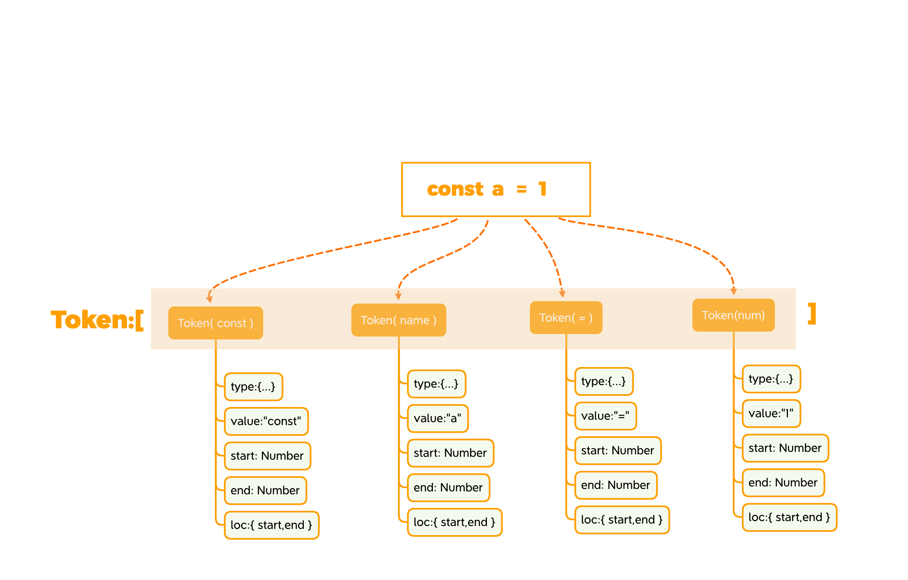
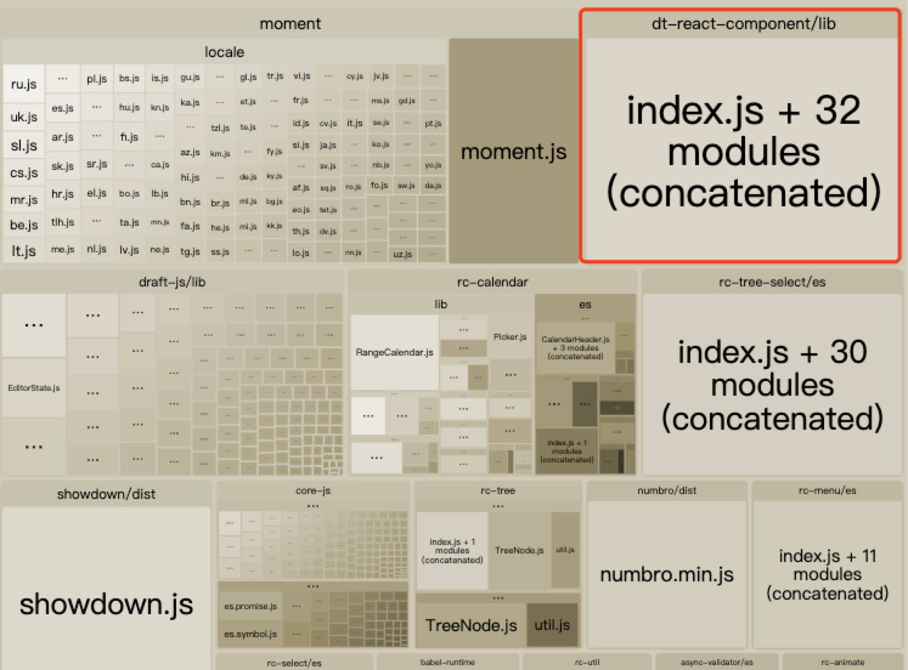
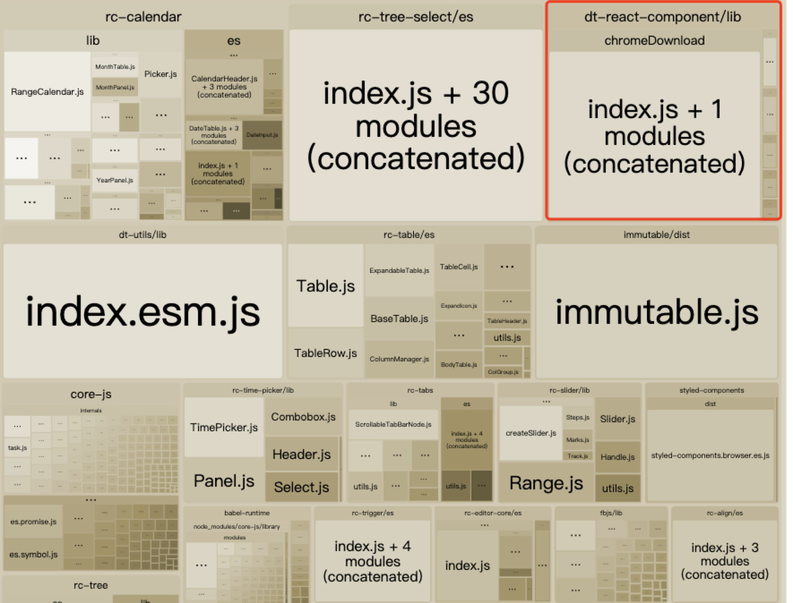

# 用 babel-plugin 实现按需加载
>  注意：本文并不是Babel的初学者教程，您需要具备一定的基础知识。在阅读本文前应具备babel基础知识，或者阅读用户手册

本文主要介绍babel的工作流程，插件的工作原理，以及一些在实战中实现按需加载时操作AST树需要注意的细节，希望本文可以帮助你尽快熟悉并上手babel-plugin，你的支持就是我的动力。

# Babel 处理流程
熟悉编译器的读者肯定知道大多数编译器均有三个过程，babel也不例外：

- 解析(Parsing)：将代码字符串解析成抽象语法树(AST)。AST是babel转译的核心数据结构，后续操作均依赖于AST

  - 分词：词法分析器会将字符串形式的代码转换为Tokens，Tokens是一组由语法片段组成的数组。如下图const a=1 会被分解成token数组的四个元素，每个元素内有更加详情的描述信息。

  - 语法分析：建立分析语法单元之间的关系，形成AST树
- 转换(Transformation)：对抽象语法树进行转换操作。插件应用于此流程
- 生成(Code Generation): 根据变换后的抽象语法树再生成代码字符串。
解析和生成的工作babel做的非常完善，想要改变生成的结果我们只需要在***转换(Transformation***）**中加入对应的插件操作生成结果即可。**

# Babel核心
babel，webpack，slate，qiankun 等都采用了微内核架构，也就是说其核心功能非常小，大部分功能都是通过插件扩展进行实现的。

@babel/core 就是“微内核”架构中的内核。这个内核主要处理这些事情：
- 加载并处理配置
- 加载插件
- 将代码通过Parse转换成AST
- 调用Traverser遍历整个AST，并使用访问者模式对AST进行转换
- 生成代码，包括SourceMap转换和源代码生成
# Babel插件本质
Babel的插件本质上就是一个个函数，在Babel对AST语法树进行转换的过程中进行介入，通过相应的操作，最终让生成的结果进行改变。

在.babelrc中的presets中的预设其实就是一组插件的集合，如果不在.babelrc中加入预设或者插件告诉babel要做什么，那么**babel不会对代码进行“翻译”**。同时parser是不支持扩展的，由官方进行维护。可以通过@区分插件是否由官方进行维护。

# Babel工具集

## 核心支持类：
### @babel/parser
它是Babel中使用的JavaScript解析器。默认启用ES2017，支持JSX，Flow，TypeScript,支持实验性的语言提议（至少是stage-0）

### @babel/traverse
它实现了访问者模式，对AST进行遍历，插件可以通过它获取相应的AST节点，并对对应节点进行具体操作。

### @babel/generator
它将AST转换成源代码，同时支持SourceMap

## 插件开发辅助类：
### @babel/template
它是一个虽然很小但非常有用的模块。主要能让你它能让你编写字符串形式且带有占位符的代码来代替手动编码， 尤其是生成的大规模 AST的时候很有用。
### @babel/types
它是一个用于 AST 节点的 Lodash 式工具库，包含构造节点，验证节点以及变换AST节点的方法。插件开发时使用很频繁。
### @babel/helper
它用于辅助代码，单纯的语法转换可能无法让代码运行起来，比如低版本浏览器无法识别class关键字，这时候需要添加辅助代码，对class进行模拟。

# 访问者模式
访问者模式是一种将数据操作和数据结构分离的设计模式。同时被誉为最复杂的设计模式，并且使用频率不高。《设计模式》的作者评价为：大多情况下，你不需要使用访问者模式，但是一旦需要使用它时，那就真的需要使用了。
babel为什么需要观察者模式？请读者试想一下AST的节点类型有这么多，如果每一个插件都自行去遍历AST那么效率不仅非常低，而且会让整个系统可读性变得极差，而且难以维护。
因此使用访问者模式去操作AST的好处就非常明显了，主要有以下优点
1. 可以对节点进行统一遍历
2. 具备优秀的扩展性和灵活性
3. 提供节点的操作方法

# 插件编写
我们的目标是实现的是一个按需加载的插件，那么在开始之前首先需要思考，我们需要做些什么工作？
当然，我们的首要任务是将引用的组件变成按需加载的形式，但是我们还需要考虑：
- 用户是否使用别名引入，如果使用别名引入要特别小心的处理作用域(Scope)，我们知道JavaScript支持词法作用域，在树状嵌套结构中代码块创建出新的作用域。那么在使用别名导入的时候就需要特别注意引用(Reference)别名绑定(Binding)的所有变量，保证在操作代码各个部分的时候不破坏他之前已经存在的代码逻辑。
- 若用户使用默认导入的形式，应停止转换并报错提示
- 用户引入某个组件后是否对其进行过引用(Reference)，如果没有引用，我们应该在操作AST的时候就删除该节点。
- 组件的名称是否为多个单词拼接而成，那么对应的按需加载地址的规则应该如何转换。应该转换成大驼峰，小驼峰还是用"-"线进行拼接
- 插件设计不应只针对某几个库使用，应该设计的更加具有扩展性，可为插件提供一些参数设置，使其更具灵活性。
具体效果如下所示：
```javascript
import {Button as Btn,Input,TimePicker,ConfigProvider,Haaaa} from 'antd'
```
转换为：

```javascript
import _ConfigProvider from "antd/lib/config-provider";
import _Button from "antd/lib/button";
import _Input from "antd/lib/input";
import _TimePicker from "antd/lib/time-picker";
```
梳理清楚我们需要实现的目标后，先来观察一下AST节点结构

```javascript
import {Button as Btn, Input} from 'antd'
```

转换成AST后结构为（已省略部分参数）：


```
{
    "type": "ImportDeclaration",
    "specifiers": [
        {
            "type": "ImportSpecifier",
            "imported": {
                "type": "Identifier",
                "loc": {
                    "identifierName": "Button"
                },
                "name": "Button"
            },
            "importKind": null,
            "local": {
                "type": "Identifier",
                "loc": {
                    "identifierName": "Btn"
                },
                "name": "Btn"
            }
        },
        {
            "type": "ImportSpecifier",
            "imported": {
                "type": "Identifier",
                "loc": {
                    "identifierName": "Input"
                },
                "name": "Input"
            },
            "importKind": null,
            "local": {
                "type": "Identifier",
                "start": 23,
                "end": 28,
                "loc": {
                    "identifierName": "Input"
                },
                "name": "Input"
            }
        }
    ],
    "importKind": "value",
    "source": {
        "type": "StringLiteral",
        "value": "antd"
    }
}
```

通过上面的AST结构，我们可以知晓插件需要处理的是ImportDeclaration节点，并遍历它的specifiers属性，如果在遍历过程中发现了ImportDefaultSpecifier节点，说明用户使用了默认导入，应该停止转换。

具体实现如下：

```javascript
module.exports = function ({ type }) {
  return {
    visitor: {
      ImportDeclaration(path, state = { opts }) {
        const { node } = path;

        if (!node) return;

        const {
          source: { value: libName },
        } = node;

        /**
         * 初始化插件的参数
         * libraryName：必要参数，库名
         * libraryDirectory：默认为lib
         * nameForm：默认转换成’-‘链接的形式，large为转换大驼峰，small为换砖小驼峰
         * toImportQueue：对转换中的个例以key-value形式给予插件，优先级大于nameForm
         */
        const {
          libraryName,
          libraryDirectory = 'lib',
          nameForm = 'default',
          toImportQueue = {},
        } = state.opts;

        /**
         * 检测用户提交的参数是否合法
         * libraryName为必填项
         */
        if (
          !libraryName ||
          typeof libraryName !== 'string' ||
          typeof libraryDirectory !== 'string' ||
          typeof nameForm !== 'string' ||
          Object.prototype.toString.call(toImportQueue) !== '[object Object]'
        )
          assert(libraryName, 'libraryName should be provided');

        /**
         * 对specifiers进行遍历，处理对应节点
         */
        const ids = {};
        const imports = [];
        if (libName === libraryName) {
          node.specifiers.forEach(item => {
            if (t.isImportSpecifier(item)) {
              const {
                local: { name: localName = undefined },
                imported: { name: importedName = undefined },
              } = item;

              if (!localName || !importedName)
                throw path.buildCodeFrameError(
                  'An error occurred in parsing the abstract syntax tree',
                );

              /**
               * 如果当前绑定的引用数量为0，就进行丢弃
               */
              if (path.scope.getBinding(localName).references === 0) return;

              /**
               * 防止变量名在其他作用域中冲突，遂利用generateUid产生一个唯一绑定
               */
              const id = path.scope.generateUid(`_${localName}`);
              ids[localName] = id;

              let horizontal;

              /**
               * 如果用户指定了地址转换的结果，就使用用户提供的
               */
              if (!JSON.stringify(toImportQueue) === '{}') {
                Object.keys(toImportQueue).forEach(key => {
                  if (key === importedName) {
                    horizontal = toImportQueue[key];
                  }
                });
              }

              if (!horizontal) {
                switch (nameForm) {
                  case 'large': {
                    horizontal = importedName[0].toUpperCase() + importedName.substr(1);
                    break;
                  }
                  case 'small': {
                    horizontal = importedName[0].toLowerCase() + importedName.substr(1);
                    break;
                  }
                  default:
                    horizontal = importedName.replace(/([a-zA-Z]+)([A-Z])/g, '$1-$2').toLowerCase();
                }
              }

              imports.push(
                t.importDeclaration(
                  [t.importDefaultSpecifier(t.identifier(id))],
                  t.StringLiteral(`${libraryName}/${libraryDirectory}/${horizontal}/index.js`),
                ),
              );

              /**
               * 查找对目标绑定的所有引用并替换它们
               */
              const currentBinding = path.scope.getBinding(localName);

              currentBinding.referencePaths.forEach(scopePath => {
                const { type } = scopePath;
                if (type === 'JSXIdentifier') {
                  scopePath.replaceWith(t.jSXIdentifier(id));
                } else {
                  scopePath.replaceWith(t.identifier(id));
                }
              });
            } else {
              throw path.buildCodeFrameError('Cannot use default import or namespace import');
            }
          });

          path.replaceWithMultiple(imports);
        }
      },
    },
  };
};

```

# Babel-Plugin如何被应用
编写好插件后，我们在.babelrc中进行引用。

```javascript
{
    "plugins": [
      [
        "dtImport",
        {
          "libraryName": "antd", // 必填项
          /**
            * libraryDirectory：默认为lib
            * nameForm：默认转换成’-‘链接的形式，large为转换大驼峰，small为换砖小驼峰
            * toImportQueue：对转换中的个例以key-value形式给予插件，优先级大于nameForm
          */
        }
      ]
    ]
  } 
```
值得注意的是，babel会按照插件被注册的顺序去执行，大部分的插件也不需要关心定义的顺序。一般来说新的或者试验性质的插件（例如本例）应该放在数组的前面，官方维护的或稳定性高的插件定义在后面，但有些则需要关心顺序，例如修饰器和类，如果先把类编译了，修饰器编译就无法正常工作了：

```
{
  "plugins": [
    "@babel/plugin-proposal-decorators",
    "@babel/plugin-proposal-class-properties"
  ]
}
```
*Note:babel配置中preset的配置的执行顺序是相反的*

```
{
  "presets": ["@babel/preset-env", "@babel/preset-react"]
}
```

# 插件结果验证

现在我们进行验证环节，针对之前思考的点，逐一进行测试，下面的代码是我们进行转换的用例：


```javascript
import ReactDOM from 'react-dom';
import React from 'react';
import { Button as Btn, Input } from 'antd';

ReactDOM.render(() => {
  return (
    <>
      <Btn>Default</Btn>
      <Input placeholder="Basic usage" />
    </>
  );
}, document.getElementById('app'));
```
转换后：

```javascript
import ReactDOM from 'react-dom';
import React from 'react';
import _Btn from 'antd/lib/button/index.js';
import _Input from 'antd/lib/input/index.js';

ReactDOM.render(() => {
  return /* #__PURE__ */ React.createElement(
    React.Fragment,
    null,
    /* #__PURE__ */ React.createElement(_Btn, null, 'Default'),
    /* #__PURE__ */ React.createElement(_Input, {
      placeholder: 'Basic usage',
    }),
  );
}, document.getElementById('app')); // // 'a'==='b'

```

从上面的验证可以看得出基本的转换已经没有问题了，那么如果我们改变一下代码，在无状态组件中加入一个闭包，里面的变量名称就用_Btn与_Input，测试一下我们的插件是否会破坏代码逻辑，顺便在import中引入一个不使用的组件与一个组合词的组件看一下插件运作是否正常。


```javascript
import ReactDOM from 'react-dom';
import React from 'react';
import { Button as Btn, Input, TimePicker, ConfigProvider } from 'antd';

ReactDOM.render(() => {
  function changeInput(e) {
    const _Btn = 'test';
    const _Input = 'test';
    console.log(e.target.value, ' ', _Btn, ' ', _Input);
  }
  return (
    <ConfigProvider>
      <Btn>Default</Btn>
      <Input placeholder="Basic usage" onChange={e => changeInput(e)} />
    </ConfigProvider>
  );
}, document.getElementById('app'));

```
转换后：

```javascript
import ReactDOM from 'react-dom';
import React from 'react';
import _Btn2 from 'antd/lib/button/index.js';
import _Input2 from 'antd/lib/input/index.js';
import _ConfigProvider from 'antd/lib/config-provider/index.js';

ReactDOM.render(({ a }) => {
  function changeInput(e) {
    const _Btn = 'test';
    const _Input = 'test';
    console.log(e.target.value, ' ', _Btn, ' ', _Input);
  }

  return /* #__PURE__ */ React.createElement(
    _ConfigProvider,
    {
      csp: {
        nonce: 'YourNonceCode',
      },
    },
    /* #__PURE__ */ React.createElement(_Btn2, null, 'Default'),
    /* #__PURE__ */ React.createElement(_Input2, {
      placeholder: 'Basic usage',
      onChange: e => changeInput(e),
    }),
  );
}, document.getElementById('app'));

```
由于我们在操作AST的时候利用scope的generateUid方法生成绑定，所以能确保变量名是唯一的。另外插件会去除没有引用的组件，并且会将组合词变成以“-”号分割，例如：ConfigProvider -> config-provider。

generateUid方法的实现如下：

```javascript
generateUid(name: string = "temp") {
  name = t
    .toIdentifier(name)
    .replace(/^_+/, "")
    .replace(/[0-9]+$/g, "");

  let uid;
  let i = 0;
  do {
    uid = this._generateUid(name, i);
    i++;
  } while (
    this.hasLabel(uid) ||
    this.hasBinding(uid) ||
    this.hasGlobal(uid) ||
    this.hasReference(uid)
  );

  const program = this.getProgramParent();
  program.references[uid] = true;
  program.uids[uid] = true;

  return uid;
}
```

最后我们把插件实装进项目中，打包公司内部的一个组件库。插件将参与wbepack打包流程，我们通过分析webpack打包完毕后的包结构可以断定插件是否生效，首先我们看一下使用插件前的分析：

使用插件后：

可以看见分析图中dt-react-component已经指向了内部对应的组件(图中可见的是指向chromeDownload组件)，由此可以断定插件测试成功

# Q & A

代码转换后出现的`_ PURE_ ` 的作用是啥？

> 作用是给没有动态分析代码依赖能力的js处理或压缩工具例如uglifyjs，terser等一个保障，保障接下去的代码在操作对象的取操作时无副作用（确保object.defineproperty()的getter函数是纯的），可以安心tree-shaking掉。注释本身对babel无意义，如果使用rollup这类有动态分析能力的工具打包，注释也无意义。

# 写在最后

目前已经演示了在各种情况下插件的使用情况与结果，因笔者水平有限，插件若存在bug也欢迎读者在评论区进行指出，若文中出现与事实不符的说明，也欢迎读者进行指出完善此文。读者也可以结合插件对css进行按需加载，补全import插件作为练习。最后推一下我司的组件库dt-react-component，单测高覆盖率，由线上业务模块提炼而成，值得信赖。