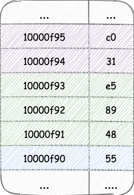
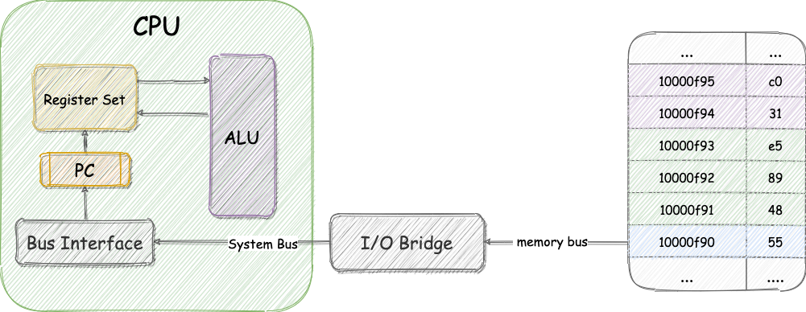
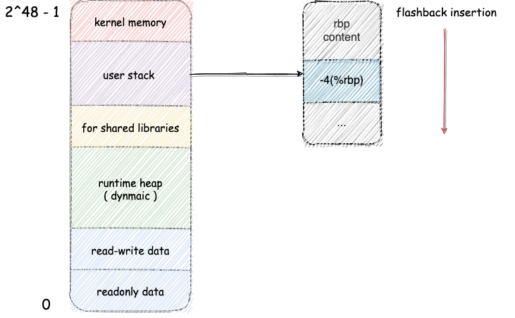
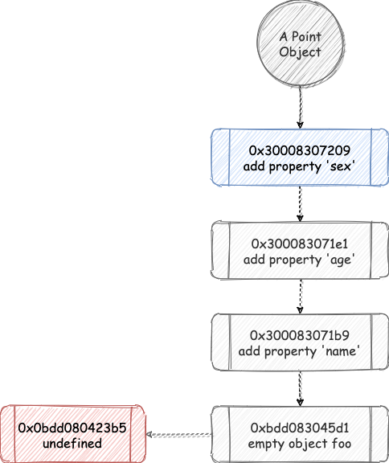
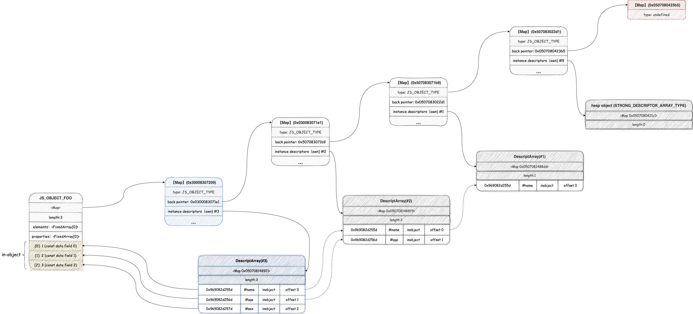
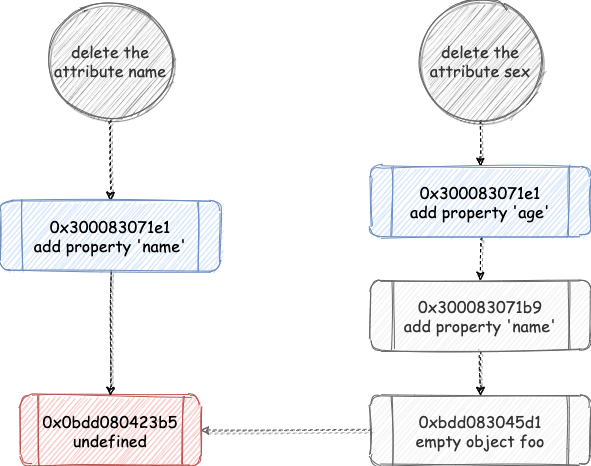

> 本文是系列的第二篇，承接 [利用 v8 深入理解 JavaScript 设计](https://zhuanlan.zhihu.com/p/361787647) 一文，并涉及部分计算机系统知识。如读者发现文中错误可以在评论区指出或联系笔者

## before start

前文中，我们从宏观的角度介绍了 JavaScript 虚拟机 V8 的作用与它的编译流水线；以及介绍了在 V8 内部是如何存储 JavaScript 对象，最后介绍了类型系统的应用。

## 对象策略

### elements & properties

在 JavaScript 中，对象字面量类型（Named）存储在 `Properties` 中，而索引类型（Array-indexed）存储在 `Elements` 中，而且每个对象在创建初会有被分配一定的对象内元素（in-object properties）提供最快速的访问效率。我们以 `利用 V8 深入理解 JavaScript 上篇` 得出的结论为基础进行对象存储策略剖析。

### 为什么静态语言执行比较快

我们知道，JavaScript 是动态类型的语言，而动态类型的语言执行速度是不如静态类型语言的，产生此结论的本质原因就是 JavaScript 等动态类型语言可以在运行时修改对象的结构信息，按照 `C/C++` 的角度来讲也可以称此为结构体 `struct`。我们以一段 C 代码为例：

```c
#include <stdio.h>
int main(){
    struct info {
        char *name;  
        int age;
    } foo;

    foo.name = "Foo";
    foo.age = 18;

    return 0;
}
```

我们可以从中了解到，C 在声明一个对象之前需要定义该对象的结构体，如（info）；结构体就是一种对象的描述，我们可以使用结构体描述来具象化相应的对象。

#### 机器码执行

为了能更好的理解 JavaScript 隐藏类的作用，我们需要先了解最基础的知识，那就是 CPU 如何执行机器码的。因此我们来看 C 编码在内存中是如何存储的。这里我们可以把这段 C 代码通过 `gcc` 编译成二进制可执行程序，之后使用 `objdump` 将其反编译成 16 进制机器码，查看它在内存中的结构。

```c
0000000100000f90 _main:
100000f90: 55                          	pushq	%rbp
100000f91: 48 89 e5                    	movq	%rsp, %rbp
100000f94: 31 c0                       	xorl	%eax, %eax
100000f96: c7 45 fc 00 00 00 00        	movl	$0, -4(%rbp)
100000f9d: 48 8d 0d 0d 00 00 00        	leaq	13(%rip), %rcx
100000fa4: 48 89 4d e8                 	movq	%rcx, -24(%rbp)
100000fa8: c7 45 f0 12 00 00 00        	movl	$18, -16(%rbp)
100000faf: 5d                          	popq	%rbp
100000fb0: c3                          	retq
```

可以发现反编译后的机器码一共有三列信息输出

- 第一列是由 `gcc` 编译生成的二进制机器码（例如：`100000f90: 55`），在这里它是使用十六进制来展示的，这主要是因为十六进制相对于二进制阅读体验更友好。同时它包含了两部分信息

  - 真实内存地址：例如（10000f90），可以把内存比作是一个非常大的有限集线性数据结构，每个元素有独一无二的标示——内存地址，每个地址块中存放着相应的数据。比如，在内存地址 1000f90 中存放的数据就是二进制 CPU 指令 `1010101` （十六进制 55）
  - 指令集：每一行代表一个指令，但根据观察我们可以发现一条指令可能有多个块构成，比如：第二行（100000f91）指令由 `48 89 e5` 构成，分别占用内存地址 `100000f91 100000f92 100000f93`



- 第二列，对应的汇编指令，采用助记符（memonic）来编写程序，也就是说汇编指令通常是某些功能性英语单词或缩写，用来表示某个操作。
- 第三列，是在硬件层面具体做的操作描述，具体见下文。

简要来讲，编码通过 `gcc`  编译后形成二进制机器码并存入指定的内存地址中，之后  CPU 会通过 PC 寄存器（ program count ）中存储的指令地址进行处理，每当取出 PC 寄存器的地址后，都会更新 PC 寄存器指向下一个指令的内存地址。 CPU 读取到对应内存地址的机器码进行指令的分析操作，并最终执行指令。之后继续读取 PC 寄存器的地址并循环上述步骤。

> PC 寄存器（Program Count），即指令地址寄存器，大小为一个 word 的存储区域，具体来说 32-bit 机器对应 1 word = 4 byte。64-bit 机器对应 1 word = 8 byte ,因此 PC 就是一个 4 byte 或者 8 byte 的存储空间。里面存放某条指令的内存地址。CPU 就在不断的执行 PC 寄存器 指向的指令，然后更新再执行。下一条指令和刚执行的指令不一定相临。内存中的 heap 存储本身也是不连续的。



一般我们把取出指令、分析指令、执行指令称为一个 CPU 时钟周期。

具备以上知识后，我们就可以来详细分析计算机到底是如何执行这段代码

##### pushq %rbp

在程序运行中系统级线程就会被分配到内存栈，栈遵循 FILO （First-In-Last-Out），所以在函数执行的时候，CPU 首先要做的就是记录下函数**栈帧地址**，其中栈帧地址一般会保存在 `rbp` 寄存器中。这里的操作其实很简单，只是让函数的栈帧入栈，并且用寄存器 `rbp` 保存栈帧的指针。

> 寄存器是 CPU 内部的存储设备，由一组单字长的寄存器构成。每个寄存器都有自己唯一的名字。它是临时存放数据的空间，CPU 一般从寄存器读取需要的数据，而不是直接从内存进行读取，因为速度差距过大，差额几乎有 100 倍之上。

##### movq %rsp, %rbp

首先把 `rsp` 寄存器的值赋值给 `rbp` 寄存器。

其中 `rsp` 寄存器一般保存函数的**栈顶指针**
由于存在全局执行上下文，因此即便只有一个 main 函数，在代码真正执行的时候，它也不是第一个运行的函数，因此就能理解这里的 `rsp` 寄存器为什么要赋值给 `rbp` 寄存器了。这里的 `rsp` 寄存器保存的是全局执行上下文的栈顶指针。而我们的 main 函数压栈在全局执行上下文的上层。

##### xorl %eax, %eax

将 `eax` 寄存器的初始化为 0，优势就是编码短、速度快。
这里的 `eax` 寄存器是"累加器"(accumulator)， 它是很多加法乘法指令的缺省寄存器。

##### movl $0, -4(%rbp)

将 0 压入当前 `rbp` 记录的函数栈帧的第一个位置

> 计算机中虽然函数执行被称为压栈操作，但在物理内存层面，实际上是对内存地址倒叙进行插入操作。换言之全局执行上下文存储在内存栈区域的最后一个地址上，而其他函数在栈内存时，内存地址序列均比全局上下文的内存序列要小。例如 `-4(%rbp)` 。



##### leaq 13(%rip), %rcx

lea 表示（load effective address）的缩写。简单的说，leaq 指令用来将一个内存地址直接赋给目的操作数。在这里就是将 rip 寄存器中的数据保存到 rcx 寄存器中。
其中这里 rip 是相对寻址寄存器，保存的是内存引用，可以重定向到制定的内容，而 `rcx` 是一个通用寄存器。
在这里，这句话就是重定向到制定的内存地址后读取到结构体 foo 中的 name 属性并把它保存到 `rcx` 通用寄存器中。

##### movq %rcx, -24(%rbp)

保存 `foo.name` 的值 `'FOO'` 到 `rcx` 寄存器后，读取它的值并把它压入 `rbp` 函数栈帧

##### movl $18, -16(%rbp)

之后处理 `foo.age = 18;` 将 18 压入 `rbp` 函数栈帧。

##### popq %rbp

函数执行完毕，将 rbp 函数栈进行 pop 操作。

##### retq

函数执行已经结束，执行 return，把 eax 寄存器中的内容默认作为返回值，而之前 eax 寄存器的值被初始化为 0。到此整个过程执行彻底结束。

从汇编代码的解析中我们可以得知，在处理 C 语言时，CPU 已经明确知道**结构体的形状**，可以把结构体比喻成预留的插槽（slot ）。因此取值时，只要移动指针到插槽位置并即可取出。

> 扩展知识：CPU 会一直读取 PC 寄存器的指令并执行，而 PC 寄存器的指令从内存中进行读取。因为 CPU 中 寄存器的存取速度和内存的存储速度差距实在太大，并且随着半导体技术的发展，差距还会越来越大。因此在处理能力比较强的 CPU 中引入了三级缓存（L1 cache,L2 cache,L3 cache）来作为寄存器获取内存地址数据的代替品，从而提高 PC 寄存器读取指令集的速度。我们可以把计算机中的存储设备按照速度排序：寄存器，L1 cache，L2 cache，L3 cache，Memory，Disk Drive，Cloud Storage。处在这组顺序的越上游，那么容量会越小，速度会越快，价格也越贵。反过来理解的话，可以说**上一层存储设备是下一层存储设备的高速缓存**，例如内存就是磁盘的高速缓存。

### 为什么需要隐藏类

从上述机器执行过程的描述中，我们可以知道，在静态语言中，对象的结构通过结构体已经定义好了，因此如果需要访问对象中相应的值，只要在内存中读取值的内存地址（也称为对象地址的偏移值）就可以进行访问，整个过程是非常流畅的。

但是 JavaScript 是一门动态语言，而几乎所有的动态语言都有类似问题，对象的形状描述在定义时并不是固定的，可以在运行时随意进行修改，例如 JavaScript 需要执行以下代码：

```javascript
const Foo = {
    name: 'Foo',
    age: 11
}
Foo.age = 12
console.log(Foo.age)
```

介于对象结构可以被随时修改，因此 V8 引擎在解析到 `console.log(Foo.age)` 时并不知道在全局上下文中对象 `Foo` 中是否有 `age` 属性，更不清楚 `Foo.age` 内存地址偏移量。因此 V8 解析 `Foo.age` 编码时，首先需要查看 `Foo` 的对象内属性是否有指定的 `age` 标示，之后还需要查看 `properties` 中是否存在 `age` 标示，如果都没有找到还需要去原型链查找对应 `age` 元素，整个查询过程是非常昂贵的，而上文提到的 C 语言在结构体定义初就已经确定了对象的形状，因此 CPU 不需要去花费额外的资源去执行查找操作，只需要在内存地址中根据地址偏移量取出内容即可。

### JavaScript 中的隐藏类

#### 隐藏类诞生

随着 JavaScript 的应用复杂度上升，需要处理的数据量也随之增大。因此业界迫切需要一种类似静态类型的方案去加速 JavaScript 的执行效率，隐藏类也应运而生。其主要是借鉴静态语言的思想**让 JavaScript 对象`静态化`**。

目前的 V8 引擎就是采用隐藏类来将 JavaScript 中的对象静态化，但因为 JavaScript 作为动态类型语言的行为是无法改变的，因此隐藏类的建立是基于一个假设条件，类似 C 语言，对象的结构体一旦声明完毕。**既不能添加属性也不能删除属性**。这就相当于我们平时经常提的 `immutable`。

#### 隐藏类行为

现在我们看看在隐藏类在 V8 中的工作方式，隐藏类主要记录的是对象的元信息（meta information），具体的讲 V8 会为每个对象建立隐藏类，并把**隐藏类作为对象的第一个属性**，当我们修改对象的时候，V8  就会以初始化的隐藏类作为基类，并新建一个隐藏类记录改变对象属性的操作和值的偏移量（class transition），最后把这个新隐藏类和目标对象进行链接。如果我们需要读取对象的值，那么只需要读取隐藏类记录的元信息，而元信息就对应着内存地址偏移量，因此可以很快通过偏移量进行寻址找到内存中存储的属性值。接下来我们通过几个例子来进一步认识隐藏类在 JavaScript 中的作用。

首先我们新建两个对象 `foo` 和 `bar`，并且均为空对象。

```javascript
const bar = Object.create(null);

const foo = {};
```

接下来我们观察下列 V8 RuntimeCall （--allow-natives-syntax）输出的对象信息，可以发现无论是什么形式的对象，在 V8 中存储格式都是一样的，其中

- `map` 指向的是隐藏类（HiddenClasses）地址
- `prototype` 指向对象原型链的内存地址，如果没有相应的原型信息那么就指向 `null`
- `elements` 指向存放索引值是数字的内存地址值
- `properties` 指向存放索引值是字符的内存地址值
- `All own properties` 显示目前对象内属性的分布情况

```c
// bar 对象信息
DebugPrint: 0xfce08148541: [JS_OBJECT_TYPE]
 - map: 0x0fce083045d1 <Map(HOLEY_ELEMENTS)> [DictionaryProperties]
 - prototype: 0x0fce08042235 <null>
 - elements: 0x0fce0804222d <FixedArray[0]> [HOLEY_ELEMENTS]
 - properties: 0x0fce081484f5 <NameDictionary[17]>
 - All own properties (excluding elements): {
 }
 
// bar 隐藏类信息（省略部分信息）
0xfce083045d1: [Map]
 - type: JS_OBJECT_TYPE
 - instance size: 12
 - inobject properties: 0
 - back pointer: 0x0fce080423b5 <undefined>
 - prototype_validity cell: 0x0fce08242405 <Cell value= 1>
 - instance descriptors (own) #0: 0x0fce080421c1 <Other heap object (STRONG_DESCRIPTOR_ARRAY_TYPE)>
 - prototype: 0x0fce08042235 <null>


// foo 对象信息
DebugPrint: 0xfce0814854d: [JS_OBJECT_TYPE]
 - map: 0x0fce083022d1 <Map(HOLEY_ELEMENTS)> [FastProperties]
 - prototype: 0x0fce082c3ce1 <Object map = 0xfce083021b9>
 - elements: 0x0fce0804222d <FixedArray[0]> [HOLEY_ELEMENTS]
 - properties: 0x0fce0804222d <FixedArray[0]>
 - All own properties (excluding elements): {}
 
 // foo 隐藏类信息（省略部分信息）
0xfce083022d1: [Map]
 - type: JS_OBJECT_TYPE
 - instance size: 28
 - inobject properties: 4
 - back pointer: 0x0fce080423b5 <undefined>
 - prototype_validity cell: 0x0fce08242405 <Cell value= 1>
 - instance descriptors (own) #0: 0x0fce080421c1 <Other heap object (STRONG_DESCRIPTOR_ARRAY_TYPE)>
 - prototype: 0x0fce082c3ce1 <Object map = 0xfce083021b9>
```

接着观察对应的隐藏类，之前我们说过，对象内属性是由对象初始定义时动态决定的，可以从隐藏类的 `inobject properties` 属性得知具体数量，比如上例中 `bar` 对象没有对象内属性，而 `foo` 对象则有 4 个位置。除此之外，隐藏类中最重要的属性之一是 `back pointer` 它指向上一级旧的隐藏类地址，**在 JavaScript 中任何对象的变化链路都会记录在相应的隐藏类上**，因此无论建立多少次空对象它们的都是**共用隐藏类**，上例中 `foo` 和 `bar` 对象隐藏类地址均为 `0xfce083022d1` 且它们的 `back pointer` 都指向同一块地址 `0x0fce080423b5`，它们就是共用隐藏类。

我们再来具体看看隐藏类的每个属性表示什么

- `type` 表示堆内数据的类型，如果值为 `JS_OBJECT_TYPE` 说明是个 JavaScript Object。
- `instance size` 表示对象在堆内的大小
- `inobject properties` 对象内属性数量，不可改变。
- `elements kind` 表示 `elements` 属性的存储类型，下文会介绍。例：`HOLEY_ELEMENTS`。
- `unused property fields` 表示未使用的属性存储空间。
- `enum length` 枚举长度。
- `stable_map/dictionary_map` 表示快属性或慢属性，也就是线性结构与字典结构的存储模式。下文会介绍。
- `back pointer` 指向之前的隐藏类，会给出对应的内存地址与 `elements kind` 作为标示。
- `instance descriptors (own)` **本质上最重要的属性，它指向 `DescriptorArray`。`DescriptorArray` 是一个线性结构的容器，存储对象内属性的具体信息，它的内部相当于一张表格，记录着对象属性的类型（是 `in-object` 属性还是 `elements` 或 `properties`）。以及属性值相对于隐藏类链的偏移量，可以通过记录的偏移量快速访问到具体的值，以模拟静态类型的效果）**。
- `prototype` 对象原型
- `constructor` 对象构造器
- ...

> 省略了 3 个属性，因笔者能力有限无法准确知道其含义，故此处省略。

了解隐藏类的基本知识后，我们看一下隐藏类在动态变化对象中的工作机制，我们以下面这段简单的编码为例：

```javascript
const foo = {}
foo.name = "foo"
foo.age = 18
foo.sex = 'male'
```

上述代码首先声明一个空对象，然后修改了对象的结构体，为其添加了三个属性，按照之前的理论可以得出，自 foo 声明后，会新生成三个隐藏类。

```c
// foo 隐藏类
0xbdd083045d1: [Map]
 - back pointer: 0x0bdd080423b5 <undefined>
 - ...

// 添加 name 后的 foo 隐藏类
0x300083071b9: [Map]
 - back pointer: 0x0300083022d1 <Map(HOLEY_ELEMENTS)>
 - ...
 
 // 添加 age 后的 foo 隐藏类 
 0x300083071e1: [Map]
 - back pointer: 0x0300083071b9  <Map(HOLEY_ELEMENTS)>
 - ...
 
 // 添加 sex 后的 foo 隐藏类
 0x30008307209: [Map]
 - back pointer: 0x0300083071e1 <Map(HOLEY_ELEMENTS)>
 - ...
```

我们从中能发现每添加一个新属性，就会产生一个新的隐藏类，而且新的隐藏类中的 `back pointer` 总是指向旧的隐藏类。



上文解释 map 中的 `instance descriptors (own)` 还是过于抽象了，我们加入 `DescriptorArray` 再来看看完整的隐藏类链。



从上图我们可以解答很多问题，比如：

Q： V8 是如何知道属性应该存放在对象内属性中还是 `elements` 或 `properties` 中？
A：因为 `DescriptorArray` 中已经记录了对象属性所属类别，所以只需要在对应类别的存储结构中插入即可。

Q： V8 的隐藏类到底是怎么让对象访问速度加快的？
A：因为 `DescriptorArray` 中记录了对象属性相对位置的偏移量，可以通过偏移量直接访问对应的值，因此模拟了静态属性，以加速对象读取速度。

#### 重构隐藏类

在隐藏类中只要改变了对象形状就会重构隐藏类，例如下面的例子：

```javascript
Reflect.deleteProperty(foo,'sex')

Reflect.deleteProperty(foo,'name')
```

我们观察隐藏类，可以发现删除 sex 属性的时候所指向的隐藏类和上文例子中 foo 对象添加 age 属性的隐藏类地址是一致的均为 `0x27b5083071e1`

```c
 // 删除 sex 属性后的 foo 隐藏类
 0x27b5083071e1: [Map]
 - back pointer: 0x27b5083071b9 <Map(HOLEY_ELEMENTS)>
 - ...
 
 // 删除 name 属性后的 foo隐藏类
 0xfa108305391: [Map]
 - back pointer: 0x0fa1080423b5 <undefined>
 - ...
```

之后我们没有按照创建隐藏类的顺序去删除属性，直接删除 name 属性后，隐藏类被重新创建。这里有个非常重要的细节，那就是隐藏类的 `back pointer` 会和我们一开始声明 `const foo = {}` 时一致，可以理解我们重新创建了一个隐藏类根节点，也就是说对象的模式从`快属性` 变成了 `慢属性` 模式。这样一个不经意的动作会带来远比之前顺序操作昂贵得多的代价。

讲完删除操作后，我们简单说说创建对象时不按照顺序构建属性会有什么后果，发生的情况如下图。其实和上例类似，隐藏类也会不通用，但不至于删除一样直接降级为慢属性，因为其仍有部分属性可能会公用隐藏类。



#### 特别说明

隐藏类是基于对象变化而动态生成的结构体链，因此即便两个对象的属性一致，他们也有情况不是共用隐藏类。除上述声明次序不同会导致这种情况外，下例也会导致两个相似对象的隐藏类不一致。

```javascript
const foo = {
  name: 'foo',
  age: 18,
  sex: 'male'
};

// foo 隐藏类信息
0x8f908307231: [Map]
 - back pointer: 0x08f908307209 <Map(HOLEY_ELEMENTS)>
```

虽然上例的 `foo` 对象的属性顺序和上文一致，但是隐藏类在创建之初就已经记录了相应的属性信息，因此它只构建了一次隐藏类，故和之前操作 `foo` 对象的内存地址不一致。

#### 不构建隐藏类

在 JavaScript 的对象中使用索引类型（Array-indexed）的更改不会触发隐藏类的变化。

```javascript
const foo = {
  name: 'foo',
  age: 18,
  sex: 'male'
};

foo[1] = '1';

foo[2] = 2;

// foo 隐藏类
0xb1f08307231: [Map]
 - back pointer: 0x0b1f08307209 <Map(HOLEY_ELEMENTS)>
 - ...
```

上述编码执行后，隐藏类一直是 `0xb1f08307231` ，索引类型的变更记录不被隐藏类追踪。

索引属性主要用于各种 `Array.prototype` 的方法，类似 `pop` ， `push` ，`slice` 等等，因此 V8 在处理索引属性的时候通常都把他们直接表示为简单数组，但这种存储方式是线性的连续存储，主要用空间以换取时间，这也是他不需要隐藏类加速辅助的原因。当然索引属性也可以通过一些方法转换为字典的形式节省空间，接下来本文的 `elements` 小节会对其进行讲解。
对象字面量类型在物理层面也是以相似的方式存储在单独的数组中，但是无法和索引类型那样只需要使用 `key` 就可以找到元素的位置，我们访问对象字面量属性均是通过隐藏类记录的类偏移量（class transition）进行访问

### 存储策略

现在我们已经清楚了隐藏类的诞生原因与相应的工作机制，本节我们详细介绍 V8 对于 Object 复杂的存储策略。

#### properties

首先我们来看对象字面量属性（`Named`），聊到字面量属性，那就必须要和系列第一篇文章提到对象内属性（`in-object-properties`） 一起说明。

在系列第一篇文章中，笔者说对象内属性在对象创建的时候默认有 10 个，当时的结论只是按照用例进行描述的，并不客观。**事实上对象内属性数量在对象定义的时候就已经决定了，而且一旦声明完毕后就无法改变。如果是无属性的空对象那默认有 4 个对象内属性的存储空间**。本期介绍隐藏类后我们可以知道，对象内属性的具体数量在它存在之时已经被记录在内部的描述信息中。因此只要我们定义的初始对象属性数量够多，那么对应的对象内属性的个数也会被分配的更多，但 V8 有规定每个实例的容量上限，因此对象内属性最多只有 `252` 个。

我们来看个例子，如下：

```javascript
const foo = {
  foo1 :'foo',
  foo2:'foo',
  foo3:'foo',
  foo4:'foo',
  foo5:'foo',
  foo6:'foo',
  foo7:'foo',
  foo8:'foo',
  foo9:'foo',
  foo10:'foo',
  foo11:'foo',
  foo12:'foo',
  foo13:'foo',
  foo14:'foo',
  foo15:'foo',
  foo16:'foo',
  foo17:'foo',
  foo18:'foo',
  foo19:'foo',
  foo20:'foo',
  foo21:'foo',
  foo22:'foo',
  foo23:'foo',
  foo24:'foo'
};
```

由于我们已经介绍了隐藏类相关概念，因此本文就不使用 `Chrome DevTool` 的截图结果了，我们直接用 V8 输出对象描述信息。

```c
// foo 对象描述
0x1c9f08148911: [JS_OBJECT_TYPE]
 - map: 0x1c9f08307579 <Map(HOLEY_ELEMENTS)> [FastProperties]
 - elements: 0x1c9f0804222d <FixedArray[0]> [HOLEY_ELEMENTS]
 - properties: 0x1c9f0804222d <FixedArray[0]>
 - All own properties (excluding elements): {
    0x1c9f080c6fcd: [String] in ReadOnlySpace: #a: 0x1c9f082d2535 <String[3]: #foo> (const data field 0), location: in-object
    ... 23 more
 }
 
// foo 隐藏类
0x1c9f08307579: [Map]
 - inobject properties: 24
```

从隐藏类中我们可以发现初始定义的所有属性都被记录为对象内属性，之后如果我们继续操作 `foo` 对象那么就会存储在 `properties`中， 而相应的读取工作，则由隐藏类包办了。

本例还可以得出对象存储策略结论之一：**对象内属性直接存储在对象本身上，并提供最快的访问速度。**

接下来我们重点关注存储在 `properties` 中的元素，存储在 `properties` 中的属性可以是线性存储的，也可以是非线性字典的模式存储，前者我们可以简称为快属性（`fast properties`），后者则是慢属性（`slow properties`）。

一般情况下对象的属性都默认是快属性，但是如果频繁修改对象（包括添加属性与 `delete` 属性），那么就会伴随大量时间和内存开销维护隐藏类，这让隐藏类带来的性能加速显得得不偿失，因此 V8 才会引入慢属性。慢属性直接存储在单独的属性字典结构中，并且与隐藏类断开联系，在慢属性中的对象修改行为都不会更新隐藏类，因此内联缓存（inline-cache）策略也不适用于慢属性，缺点显而易见，就是读取速度很慢。

我们用本系列第一篇文章中的例子来证明：

```javascript
function Foo(_elementsNum, _propertiesNum) {
  let [eNum, pNum] = [_elementsNum, _propertiesNum];
  // set elements
  while (eNum > 0) {
    this[eNum] = `element${eNum}`;
    eNum--;
  }
  // set property
  while (pNum > 0) {
    let ppt = `property${pNum}`;
    this[ppt] = ppt + 'value';
    pNum--;
  }
}

const foos = new Foo(1000, 1000);
foo.name = 'foo';
```

观察其隐藏类属性，指向的内存地址为初始 `undefined`，改变对象属性后，隐藏类的属性也没有任何变化。

```c
// 添加 name 属性前的 foo
0x9dd08307669: [Map]
 - back pointer: 0x09dd080423b5 <undefined>

// 添加 name 属性后的 foo
0x9dd08307669: [Map]
 - back pointer: 0x09dd080423b5 <undefined>
```

快属性行为笔者就不演示了，因为本文很多例子都是快属性对象。因此我们已经可以得出对象存储策略结论：**快属性线性存储在 `properties` 中，并且属性的所有修改都会绑定隐藏类的描述符数组。而慢属性单独使用字典结构存储，其元数据（meta data）不与隐藏类共享，因此慢属性拥有比快属性更高效的对象修改功能（添加与删除属性）但是访问元素的速度比对象内属性和快属性要慢。**

#### elements

通过上一小节我们深入探讨关于对象 `properties` 的存储策略，也许你会好奇， `elements` 的结构相对于 `properties` 来说简单很多，有何必要单独提。但事实上 `elements` 的处理复杂度几乎和 `properties` 一致，有多达 20 种不同的处理方案。我们从中选几种有代表性策略进行说明

##### 快属性与字典属性

前文提到， `element` 属性的存储是线性的，因此如果是稀疏数组就会额外占用很多空间，得不偿失，因此 V8 会将稀疏数组降级为字典，成为字典属性后的 `elements` 元素有和 `slow properties` 相同的行为，使用单独的字典进行存储维护！

有两种开启字典属性的方法

- 设置稀疏数组，自动降级为字典模式
- 设置对象的 `descriptor` ，不等于对象定义属性的默认值即可
对象 `descriptor` 的默认值如下：

```null
configurable: true
enumerable: true
value: 'any'
writable: true
```

现在，我们来看一个具体的例子

```javascript
const foo = {
};

// 使用 defineProperty 而不定义具体的描述信息，会导致 defineProperty 方法默认值和对象直接定义属性的默认值不一致。
Reflect.defineProperty(foo,'1',{
  value: 1
});

foo[9999] = 'foo';

```

我们定义 foo 后，使用了 `Reflect.defineProperty` 降级 `elements` 为字典属性，因此隐藏类的地址发生了改变。由于我们已经降级为字典属性，所以我们使用稀疏数组定义 `[9999]` 后，隐藏类没有发生变化。

```c
// foo 隐藏类
0x19b1083022d1: [Map]
 - back pointer: 0x19b1080423b5 <undefined>
 - ...

// 添加属性 '1' 后的 foo 隐藏类
0x19b108307209: [Map]
 - back pointer: 0x19b1083022d1 
 - ...

// 添加属性 '9999' 后的 foo 隐藏类
0x19b108307209: [Map]
 - back pointer: 0x19b1083022d1 
 - ...
```

##### Packed 或 Holey

V8 分辨 `elements` 属性的另一个非常重要的区别就是元素是充满（Packed）还是有孔的（Holey），如果在一个连续存储元素的对象中删除了某个元素，那么就会留下孔，一旦元素有孔，那么 V8 就需要额外去原型链上查找相应数据。

```javascript
const foo = [1, 2, 3]; // Packed
const bar = [1, , 3]; // Holey

bar.__proto__={1: 2};

console.log(bar[1]) // 2
```

上例中的 bar 是一个 `Holey` 对象，因此 V8 在处理 `bar[1]` 时需要额外去查找原型链数据，以确定是否有属性 `'1'`，倘若 `bar` 对象是快属性，那么其变化不会被记录到隐藏类中，那此处就需要额外的变量 `the_hole` 进行标记为不存在属性。这对数组元素的性能影响很大。因此我们尽量让对象保持 `Packed` 只进行对象的“本地”操作，而不去原型链进行昂贵的查找工作。

##### Smi 和 Double

如果 `elements` 属性是快属性，那么 V8 在处理的时候还会更进一步划分。如果我们存储的内容都是整数，那么虽然存在堆中，但是 GC 算法会忽略它，因为它被编码成小整数 `Smis`。另外如果包含了双精度类型，那么 V8 会为纯双精度数组存储原始双精度值，避免额外的性能开销。下面举几个例子：

```javascript
const foo1 = [1, 2, 3];
const foo2 = [1, , 3];
const foo3 = [1.1, 2.2, 3];
const foo4 = [1.1, , 3];
```

打印对应的对象描述，`foo1` 和 `foo2` 都是小整数处理，而 `foo3` 和 `foo4` 则是双精度处理。

```c
// foo1 的对象描述： PACKED、SMI
DebugPrint: 0x334d08148851: [JSArray]
 - map: 0x334d08303951 <Map(PACKED_SMI_ELEMENTS)> [FastProperties]

// foo2 的对象描述：HOLEY、SMI
DebugPrint: 0x334d08148861: [JSArray]
 - map: 0x334d083039c9 <Map(HOLEY_SMI_ELEMENTS)> [FastProperties]

// foo3 的对象描述：PACKED、DOUBLE
DebugPrint: 0xdc308148869: [JSArray]
 - map: 0x0dc3083039f1 <Map(PACKED_DOUBLE_ELEMENTS)> [FastProperties]

// foo4 的对象描述：HOLEY、DOUBLE
DebugPrint: 0xdc308148899: [JSArray]
 - map: 0x0dc308303a19 <Map(HOLEY_DOUBLE_ELEMENTS)> [FastProperties]
```

## 总结

本文我们详细的扩展了 V8 对于 JavaScript 对象所做的优化策略，并且介绍了 CPU 是如何执行机器码的，从而引出 V8 需要隐藏类的原因，最终讲述对象存储具体使用的策略。而了解这些底层策略是掌握 JavaScript 代码中很多优化的关键，因为从一段编码中你能看见比别人更多的东西，你也就可以顺理成章的解释为什么某段代码会比其他代码执行效率更高。

其中提到的很多内容会和本系列第三篇——利用 V8 深入理解函数策略相呼应，在函数策略一文中笔者会详细介绍基于隐藏类的内联缓存和反馈向量等内容，并且笔者会从机器码层面帮助大家理解函数闭包与 V8 字节码。在这之前同学们可以深刻理解下本文的内容，有任何疑问欢迎在评论区提出。

## 参考资料

- [Fast properties in V8](https://v8.dev/blog/fast-properties)
- [How JavaScript works: inside the V8 engine + 5 tips on how to write optimized code](https://blog.sessionstack.com/how-javascript-works-inside-the-v8-engine-5-tips-on-how-to-write-optimized-code-ac089e62b12e)
