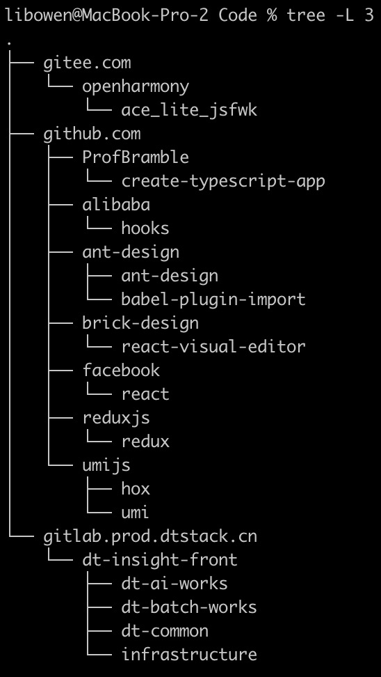
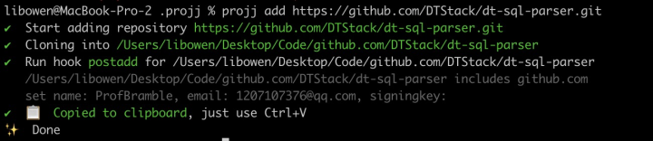
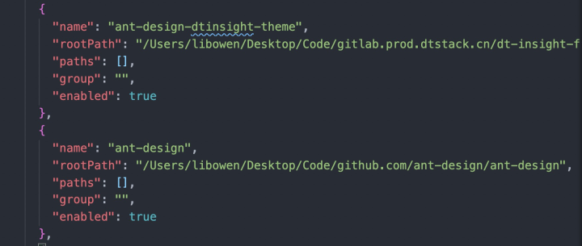

> 对本地 git 仓库的代码管理，你是如何做的呢？大家的习惯不尽相同。或许有部分人选择每个项目一个文件夹在桌面铺开，省心。还有部分人会按照公司项目维度，个人项目维度或是基础建设维度自己建立文件夹对项目进行管理。如果你属于这两者中的后者，那么本文会帮助你更加智能的管理本地代码，如果你是前者，那么本文就是为您定制的懒人专用省心方案。

*Note：本文对应mac操作系统，vsCode环境演示如何优雅并高效的解决本地仓库代码管理。*

笔者我属于喜欢在桌面把项目一路铺开，选择省心的懒人，但随着各种项目的增多，工作经历的增长，我遇到了以下几个问题：
1. 在桌面上项目找某个项目变得不像以前那样扫一眼就可以找到
2. 时间久远后，不太记得某个仓库的作用
3. 拉取同名的仓库的时候，本身就是弱管理的桌面变得雪上加霜
4. 我在公司内部的git身份和外部的git身份不一致，如果忘记git config就提交了代码，还得git reset调整后再进行提交

处于这种情况下的我，不想在未来成为一只被稻草压死的骆驼，遂开始查找解决这些需求的方案。最后我本地实践的方案即为projj+projj hooks与vs code插件project manage的组合，来优雅的管理本地仓库。
下面进入介绍与实践工具的环节：

## Projj —— Manage repository easily.

`projj` 工具出的时间确实已经挺久了，但其确实可以帮助我们非常方便的管理本地的代码仓库，可以把代码管理成一个非常清晰的结构，如下图所示，整体的目录结构为：根目录 / git仓库域名 / 组织或个人名 / 具体项目


```json
$BASE
|- github.com
|  `- popomore
|     `- projj
`- gitlab.com
   `- popomore
      `- projj
```

这样拆分后本地仓库的结构划分非常的清晰，保证本地目录的一致性。并且很直观的解决了同名仓库的问题。组织名与项目程父子级的结构也帮助我们记忆某些不常用的包的功能与定位，顺便也解决了项目过多寻找不便的情况。

`projj-hooks`  是projj的钩子可以在配置文件的hooks中进行配置，可以解决git身份不一致场景下的自动转换，管理组织下的node_modules文件的清理等工作。

首先进行安装

```
yarn global add projj projj-hooks
```

安装完毕后进行projj初始化，默认目录在user下建立projj目录


```
projj init // default path is ~/projj
```

使用 `projj add` 对仓库进行添加与 git clone 无异，但我们之前安装的 hooks 可以更加灵活的处理，详细见 hooks 部分的介绍。

```
projj add URI // such as github url or gitlab url
```

对于本地已经存在的仓库想要加入 projj 的管理体系，只需要使用如下命令即可.

```
projj import ~/projectPath
```
完成上述操作后，我的目录已经结构变得和projj描述的那样清晰明了，可以用tree命令进行查看



## Projj hooks —— Hooks for Projj

projj hooks提供一些非常灵活的钩子指令，能在仓库目录运行各种命令。

打开projj目录下的 config.json 对hook进行配置。

```bash
{
  "base": [
    "/Users/libowen/Desktop/Code"
  ],
  "hooks": {
    "postadd": "projj_git_config_user",
  },
  "postadd": {
    "github.com": {
      "name": "ProfBramble",
      "email": "1207107376@qq.com"
    },
    "gitlab.prod.dtstack.cn": {
      "name": "chenfeng",
      "email": "chenfeng@dtstack.com"
    }
  }
}
```

笔者在此就配置了有关git身份内外网切换的hook设置。配置完毕后，我们进行测试，从github上拉取项目，查看projj的显示结果



我们可以看见 projj 已经输出了他将身份改成github的身份，并且已经将项目路径放入粘贴板，直接ctrl+v即可粘贴路径。

如果需要单独对某个项目使用hook，可以用projj run 的方式。例如：

```
projj run postadd
projj run clean // clean node_modules and ignored git files.
projj run dirty // check git repository whether dirty or not.
```

如果官方预设的钩子无法满足需求，也支持自己写一个hook程序。假设你需要一个可以切换git内外网身份的hook（仅作为例子，该命令已是预设）：


```bash
#!/usr/bin/env node
'use strict';
const fs = require('fs');
const path = require('path');
const cwd = process.cwd();
const gitConfig = path.join(cwd, '.git/config');
if (!fs.existsSync(gitConfig)) {
  return;
}
if (cwd.indexOf('gitlab.com') > -1 || cwd.indexOf('github.com') > -1) {
  fs.appendFileSync(gitConfig, '[user]\n  name = 名字\n  email = 邮箱\n');
}
```
将此文件添加到 `~/.projj/hooks/git_config_user`，并添加执行权限 chmod +x `~/.projj/hooks/git_config_user`

## Project manage

现在我们已经基本满足了本地仓库的管理，projj管理的目录结构层次虽然清晰，但是相对的路径也比较深。对于终端快速切换至各个项目的情景还是略有麻烦，当然这点也根据大家习惯略有不同。
因此请出 vscode-project-manager 他可以帮助我们快速跳跃进各项目，并可以配合projj hook进行使用。
在vscode对其安装完毕后，在左侧的菜单栏会出现以下图标


如果想方便省事，可以直接点击project manager保存按钮，就可以创建项目快捷入口


如果想要修改项目现有配置，或者进行分组等自定义操作，可以点击保存旁边的编辑按钮直接修改配置文件即可。



在实际使用中，直接双击可以把当前vscode变成制定项目，或者单机最右侧的箭头新开一个窗口即可。


## 终端
关于终端，由于大家的习惯不同而且各大平台已经有很多不错的实践案例了，笔者也不再进行赘述，我个人感觉在有大屏的前提下，oh-my-zsh配合vscode终端的方案还是比较舒服的，当然在iTerm中使用也是不错的方案。
