# 利用 V8 深入理解 JavaScript 设计

## JavaScript 代码运行

以大家开发常用的 chrome 浏览器或 Node 举例，我们的 JavaScript 代码是通过 V8 运行的。但 V8 是怎么执行代码的呢？当我们输入 `const foo = {foo:'foo'}` 时 V8 又做了什么？笔者先抛出以上问题，我们接着往下看。

## JavaScript 存储

在代码运行时，最重要的前提便是有一个能够存储状态的地方，这便是我们所述的堆栈空间。我们的基础类型是保存在栈中的，会自动进行回收；而复合类型是保存在堆中的，通过 GC 操作进行空间释放。这一过程对于用户来说是隐式的，因此用户必须按照 JavaScript 的规范来写代码，如果没有符合规范，那 GC 就无法正确的回收空间，因此会造成 ML 现象，更严重的就会造成 OOM。

为了更直观的看清每一种类型在内存中的存储形式，笔者创建了一个基础类型变量 `Foo`，复合类型 `Bar`，以及一个声明 `John`，并给出它们在内存堆栈中的状态图：

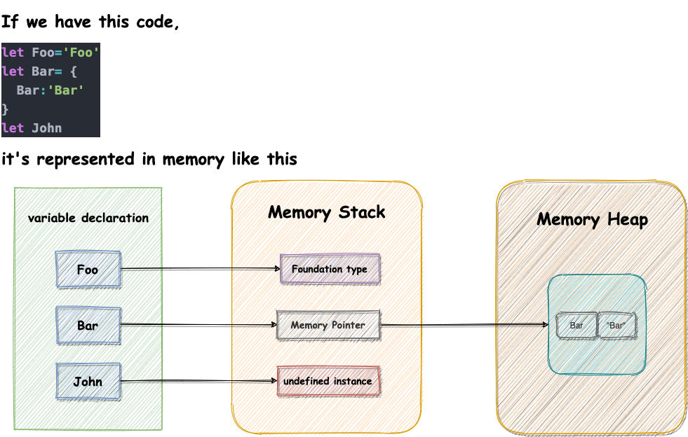

### 关于 GC

通过上述分析，我们提到了 GC 会对无效对象进行回收以及空间释放，对于用户而言，不管是基础类型还是复合类型他们的声明与释放都是自动的。但实际上**关于堆的回收是手动的**，只是在 V8 层面已经帮我们实现了而已，并且这一过程也不是完全免费的（`write barrier`）。但这一自动的过程让很大部分开发人可以完全忽视它的存在，显然 JavaScript 是故意设计如此

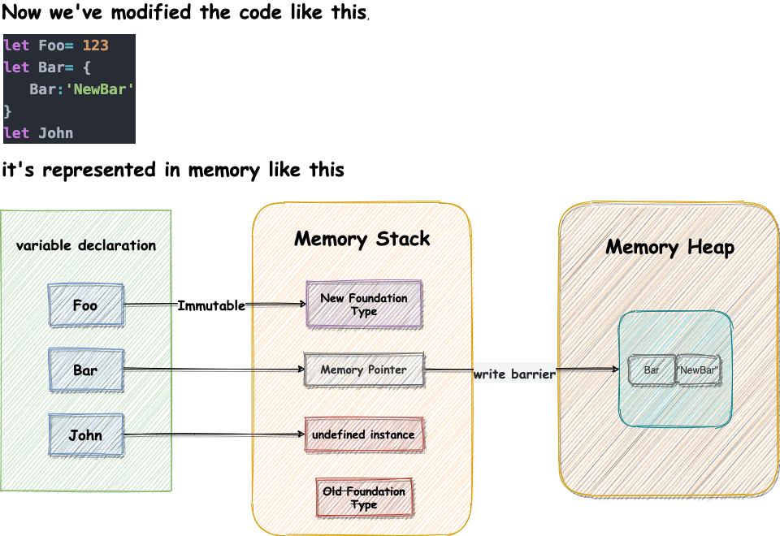

> write barrier 用于在异步三色标记算法进行中通知 GC 目前对象图变更的所有操作，以保证三色标记法在异步过程中的准确性, v8 插入的 write barrier 代码

``` javascript
// Called after `object.field = value`.
write_barrier(object, field_offset, value) {
  if (color(object) == black && color(value) == white) {
    set_color(value, grey);
    marking_worklist.push(value);
  }
}
```

### JavaScript 的定位

使用过 `C / C++` 的同学一定对需要使用内置关键字 `free`, `delete`, `delete[ ]` 手动操作内存和释放内存有很深的体会，同时 `GO` 和 `D` 也存在着**指针**的概念。一般来说，如果一门语言是定位在“系统级别”都可以直接操作内存空间，除了上述提到的语言外，`Rust`也是一门系统级别的语言，FileFox 的 VM `TraceMonkey` 就用此语言进行编写。值得一提的是 `TraceMonkey` 的前身 `MoonMonkey` 就是世界上第一款 JavaScript 引擎。当然，这里所谓直接操作内存堆栈内容，还是经过了硬件的一些映射，我们的高级语言在 OS 的上层，因此 OS 依旧给程序造成了直接操作内存的假象。

回到 JavaScript ，显然它**并不是一门定义在“系统级别”的语言**，更多的是更上游的**应用级别**语言，因此语言的设计以及应用场景都更加趋向于把一些底层的概念进行隐藏。除了语言的定位以外，JavaScript 是一门动态类型的语言，这意味着在语言运行时有非常多的运行信息，里面记录着诸如`全局执行上下文`、`全局作用域`、`原型链继承` 信息等等，正因为这些特性必须在运行时才可以完成，因此又多了一个需要 V8 的理由，同时也引出了 V8 中解释器的作用。

#### 关于 CPU

在介绍解释器之前，我们先来看看 CPU。现在的 CPU 很复杂，我们先把 CPU 纯粹化，即拥有简单的指令集、ALU、寄存器。它在执行代码的时候思想其实很简单，就是一大串`if ... else ...`来判断当前的指令代码，解析指令。换言之，CPU 的基本工作只是按照操作码进行计算和跳转，它不会检查程序是否正确，只要操作码匹配上就会执行，自然也不会管内容的堆栈中到底是什么数据。以下是 `RISC-V` 处理器代码片段，可以看到其只是通过判断指令，执行相应操作。

```shell
  while(1){
    iters++;
    if((iters % 500) == 0)
      write(1, which_child?"B":"A", 1);
    int what = rand() % 23;
    if(what == 1){
      close(open("grindir/../a", O_CREATE|O_RDWR));
    } else if(what == 2){
      close(open("grindir/../grindir/../b", O_CREATE|O_RDWR));
    } else if(what == 3){
      unlink("grindir/../a");
    } else if(what == 4){
      if(chdir("grindir") != 0){
        printf("grind: chdir grindir failed\n");
        exit(1);
      }
      unlink("../b");
      chdir("/");
    } else if(what == 5){
      close(fd);
      fd = open("/grindir/../a", O_CREATE|O_RDWR);
    } else if(what == 6){
      close(fd);
      fd = open("/./grindir/./../b", O_CREATE|O_RDWR);
    } else if(what == 7){
      write(fd, buf, sizeof(buf));
    } else if(what == 8){
      read(fd, buf, sizeof(buf));
    } else if(what == 9){
      mkdir("grindir/../a");
      close(open("a/../a/./a", O_CREATE|O_RDWR));
      unlink("a/a");
    } else if(what == 10){
      mkdir("/../b");
      close(open("grindir/../b/b", O_CREATE|O_RDWR));
      unlink("b/b");
    } else if(what == 11){
      unlink("b");
      link("../grindir/./../a", "../b");
    } else if(what == 12){
      unlink("../grindir/../a");
      link(".././b", "/grindir/../a");
    } else if(what == 13){
      int pid = fork();
      if(pid == 0){
        exit(0);
      } else if(pid < 0){
        printf("grind: fork failed\n");
        exit(1);
      }
      wait(0);
    } else if(what == 14){
      int pid = fork();
      if(pid == 0){
        fork();
        fork();
        exit(0);
      } else if(pid < 0){
        printf("grind: fork failed\n");
```

那么回到 V8，V8 的解释器的作用之一就是**记录程序的运行时状态**，可以做到跟踪内存情况，变量类型监控，以保证代码执行的安全性。在 `C / C++` 中手动操作内存的语言中如果内存出现小越界并不一定会导致程序崩溃，但结果肯定会出问题，但这样排查又很耗时间。

既然我已经提到了 V8 解释器相关的概念，那我们对此继续进行扩展，正因为 JavaScript 是一门动态类型的语言，因此需要解释器对编码进行处理，所以早期的 JavaScript 引擎运行代码的速度很慢，因此解释器有一个很大的特点，那就是**启动速度快，执行速度慢**。为了改善这个问题，因此 V8 最早引入了即时编译（JIT）的概念，后来其他引擎也相继引入，因此现在流行的大部分 JavaScript 引擎都拥有该特性。它主要使用了权衡策略，同时使用了解释器和编译器。编译器具有**启动速度慢，执行速度快**的特点。他们是这样配合工作的：代码转换成 AST 后先交给解释器进行处理，如果解释器监控到有部分 JavaScript 代码运行的次数较多，并且是固定结构，那么就会标记为热点代码并交给编译器进行处理，编译器会把那部分代码编译为二进制机器码，并进行优化，优化后的二进制代码交给 CPU 执行速度就会得到大幅提升。同时这又引出一个需要 V8 的理由：由于不同的 `CPU` 的指令集是不同的，因此为了做到**跨平台**肯定得做一层抽象，而 V8 就是这层抽象，以脱离目标机代码的机器相关性。

谈到这里，同学们也一定清楚了我们为什么需要 V8 以及 V8 底层大致是如何执行一段 JavaScript 代码的，但笔者在上述过程中最主要的还是引出我们需要 V8 的原因，所以我规避了很多 V8 编译时产生的细节。简要来说，JavaScript 是一门应用定位的语言，为了方便做到安全性，跨平台，运行时状态的控制等需求，所以我们选择在真实机器上再套一层进行处理，也可以叫这层为 VM （虚拟机）

## V8 编译过程

下面我们在详细论述一下 V8 是如何执行 JavaScript 代码的，根据前面所述 V8 为了提升执行效率，混合使用了解释执行与编译执行，也就是我们所说的即时编译（Just In Time），目前使用这类方式的语言也有好多比如 Java 的 `JVM`,  lua 脚本的 `LuaJIT` 等等。

当我们执行编码

```JavaScript
foo({foo: 1});

function foo(obj) {
  const bar = obj.foo + 1
  
  return bar + '1'
}
```

我们可以发现 foo 是可以执行的，在 JavaScript 语言中我们称这种现象为**变量提升**，但从另一个角度理解，注意我上面写的称呼了么？**编码**；我们所写的程序代码只是给人类看的，对于机器来说只是无意义的字符，正因此所以也叫高级语言。所以最终的执行和我们写的编码完全可以不对等，因此不能完全按照我们的编码去理解执行。

可是机器是如何处理我们的编码的呢？由于编码字符串对于机器来说并不容易操作，因此我们会把它转换成 AST (抽象语法树)，使用这种树状的数据结构，可以非常清晰有效的操作我们的编码，把其最终编译为机器可以理解的机械语言。

那么 V8 是如何处理变量提升的呢，很显然在 V8 启动执行 JavaScript 代码之前，它就需要知道有哪些变量声明语句，把其置入作用域内。

根据如上分析，我们可以知道 V8 在启动时，首先需要初始化执行环境，而 V8 中主要的初始化操作为：

- 初始化“堆空间”、“栈空间”
- 初始化全局上下文环境，包括执行过程中的全局信息，变量等
- 初始化全局作用域。而函数作用域以及其他子作用域是执行时才存在的
- 初始化事件循环系统

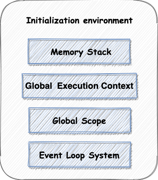

完成初始化工作后，V8 会使用解析器把编码结构化成 AST，下面我们看一下 V8 生成的 AST 是什么样的，执行的编码以笔者上文中的例子为准

```shell
[generating bytecode for function: foo]
--- AST ---
FUNC at 28
. KIND 0
. LITERAL ID 1
. SUSPEND COUNT 0
. NAME "foo"
. PARAMS
. . VAR (0x7fe5318086d8) (mode = VAR, assigned = false) "obj"
. DECLS
. . VARIABLE (0x7fe5318086d8) (mode = VAR, assigned = false) "obj"
. . VARIABLE (0x7fe531808780) (mode = CONST, assigned = false) "bar"
. BLOCK NOCOMPLETIONS at -1
. . EXPRESSION STATEMENT at 50
. . . INIT at 50
. . . . VAR PROXY local[0] (0x7fe531808780) (mode = CONST, assigned = false) "bar"
. . . . ADD at 58
. . . . . PROPERTY at 54
. . . . . . VAR PROXY parameter[0] (0x7fe5318086d8) (mode = VAR, assigned = false) "obj"
. . . . . . NAME foo
. . . . . LITERAL 1
. RETURN at 67
. . ADD at 78
. . . VAR PROXY local[0] (0x7fe531808780) (mode = CONST, assigned = false) "bar"
. . . LITERAL "1"
```

以上是 V8 输出的 AST 语法树格式，虽然展示上并不是很直观，但它在本质上和 `babel / acorn` 等 JavaScript Parser 所编译的 AST Tree 是一样的，它们均遵循 ESTree 规范。将其转换成我们的熟悉的格式如下：

```JSON
{
  "type": "Program",
  "body": [
    {
      "type": "FunctionDeclaration",
      "id": {
        "type": "Identifier",
        "name": "foo"
      },
      "params": [
        {
          "type": "Identifier",
          "name": "obj"
        }
      ],
      "body": {
        "type": "BlockStatement",
        "body": [
          {
            "type": "VariableDeclaration",
            "declarations": [
              {
                "type": "VariableDeclarator",
                "id": {
                  "type": "Identifier",
                  "name": "bar"
                },
                "init": {
                  "type": "BinaryExpression",
                  "left": {
                    "type": "MemberExpression",
                    "object": {
                      "type": "Identifier",
                      "name": "obj"
                    },
                    "property": {
                      "type": "Identifier",
                      "name": "foo"
                    },
                  },
                  "operator": "+",
                  "right": {
                    "type": "Literal",
                    "value": 1,
                    "raw": "1"
                  }
                }
              }
            ],
          },
          {
            "type": "ReturnStatement",
            "start": 51,
            "end": 67,
            "argument": {
              "type": "BinaryExpression",
              "left": {
                "type": "Identifier",
                "name": "bar"
              },
              "operator": "+",
              "right": {
                "type": "Literal",
                "value": "1",
                "raw": "'1'"
              }
            }
          }
        ]
      }
    }
  ],
}
```

对编码转换 AST 后，就完成了对 JavaScript 编码的结构化表述了，编译器就可以对源码进行相应的操作了，在生成 AST 的同时，还会生成与之对应的作用域，比如上述代码就会产生如下作用域内容：

```shell
Global scope:
global { // (0x7f91fb010a48) (0, 51)
  // will be compiled
  // 1 stack slots
  // temporary vars:
  TEMPORARY .result;  // (0x7f91fb010ef8) local[0]
  // local vars:
  VAR foo;  // (0x7f91fb010e68)

  function foo () { // (0x7f91fb010ca8) (20, 51)
    // lazily parsed
    // 2 heap slots
  }
}
Global scope:
function foo () { // (0x7f91fb010c60) (20, 51)
  // will be compiled
}
```

上面这行代码生成了一个全局作用域，我们可以看到 foo 变量被添加进了这个全局作用域中。

### 字节码

完成上述步骤后，解释器 `Ignition` 会根据 AST 生成对应的字节码

> 由于 JavaScript 字节码目前并没有和 JVM 或 ESTree 那样标准化，因此其格式会与 V8 引擎版本紧密相关。

### 看懂一段字节码

字节码是机器码的抽象，如果字节码采用和物理 CPU 相同的计算模型进行设计，那字节码编译为机器码会更容易，这就是说解释器常常是寄存器或堆栈。换言之 `Ignition` 是具有累加器的寄存器。

V8 的字节码头文件 [bytecodes.h](https://github.com/v8/v8/blob/master/src/interpreter/bytecodes.h) 定义了字节码的所有种类。把这些字节码的描述块组合在一起就可以构成任何 JavaScript 功能。
> 很多的字节码都满足以下正则 `/^(Lda|Sta).+$/` 它们当中的 `a` 代指累加器 (accumulator)，主要用于描述把值操作到累加器寄存器中，或把当前在累加器中的值取出并存储在寄存器中。因此可以把解释器理解成是带有累加器的寄存器

上述事例代码通过 V8 解释器输出的 JavaScript 字节码如下：

```shell
[generated bytecode for function: foo (0x3a50082d25cd <SharedFunctionInfo foo>)]
Bytecode length: 14
Parameter count 2
Register count 1
Frame size 8
OSR nesting level: 0
Bytecode Age: 0
         0x3a50082d278e @    0 : 28 03 00 01       LdaNamedProperty a0, [0], [1]
         0x3a50082d2792 @    4 : 41 01 00          AddSmi [1], [0]
         0x3a50082d2795 @    7 : c6                Star0
         0x3a50082d2796 @    8 : 12 01             LdaConstant [1]
         0x3a50082d2798 @   10 : 35 fa 03          Add r0, [3]
         0x3a50082d279b @   13 : ab                Return
Constant pool (size = 2)
0x3a50082d275d: [FixedArray] in OldSpace
 - map: 0x3a5008042205 <Map>
 - length: 2
           0: 0x3a50082d2535 <String[3]: #foo>
           1: 0x3a500804494d <String[1]: #1>
Handler Table (size = 0)
Source Position Table (size = 0)
```

我们先来看看 foo 函数的字节码输出，`LdaNamedProperty a0, [0], [1]` 将 a0 命名的属性加载到累加器中，a[i]中的 i 表示的是 arguments[i-1] 的也就是函数的第 i 个参数。那么这个操作就是取出函数的第一个参数放入累加器，后面跟着的 `[0]` 表示 的是 `0: 0x30c4082d2535 <String[3]: #foo>` ，也就是 `a0.foo`。最后的 `[1]` 表示反馈向量索引，反馈向量包含用于性能优化的 runtime 信息。简要来说是把 `obj.foo` 放入累加器。

紧接着 `AddSmi [1], [0]` 表示让累加器中的值和 [1] 相加，由于这是数字 1 因此没有存在对应的表中。最后累加器中的值已经存储为 2。最后的 `[0]` 表示反馈向量索引

由于我们定义了一个变量来存储累加器结果，因此字节码也对应了响应的存储码 `Star0` 表示取出对应累加器的值并存储到寄存器 r0 中。

`LdaConstant [1]` 表示取对应表中的第 `[i]` 个元素存入累加器，也就是取出 `1: 0x3a500804494d <String[1]: #1>`, 存入累加器。

`Add r0, [3]` 表示当前累加器的值 `'1'` 与寄存器 `r0` 的值：`2` 进行累加，最后的 `[3]` 表示反馈向量索引

最后的 `Return` 表示返回当前累加器的值 `'21'`。返回语句是函数 `Foo()` 的介绍，此时 Foo 函数的调用者可以再累加器获得对应值，并进一步处理。

### 字节码的运用

由于字节码是机器码的抽象，因此在运行时会比我们的编码直接交给 V8 来的更加友好，因为如果对 V8 直接输入字节码，就可以跳过对应的使用 Parser 生成对应 AST 树的流程，换言之在性能上会有较大的提升，并且在安全性上也有非常好的保障。因为字节码经历了完整的编译流程，抹除了源码中携带的额外语义信息，其逆向难度可以与传统的编译型语言相比。

在 npm 上发现了 [Bytenode](https://www.npmjs.com/package/bytenode)，它是 作用于 Node.js 的字节码编译器( bytecode compiler )，能把 JavaScript 编译成真正的 V8 字节码从而保护源代码，目前笔者也看见有人进行过这方面应用的详细分享，详情可见文末的参考文献。

### 即时编译的解释执行与编译执行

生成字节码后，V8 编译流程有两条链路可以选择，常规代码会直接执行字节码，由字节码的编译器直接执行。处理字节码的 `parser`  笔者没有对其了解，姑且可以先理解成字节码最后以 `gcc` 处理成机器代码执行。

当我们发现执行代码中有重复执行的代码，V8 的监控器会将其标记为热点代码，并提交给编译器 `TurboFan` 执行，`TurboFan` 会将字节码编译成 `Optimized Machine Code`，优化后的机器代码执行效率会获得极大的提升。

但是 JavaScript 是一门动态语言，有非常多的运行时状态信息，因此我们的数据结构可以在运行时被任意修改，而编译器优化后的机器码只能够处理固定的结构，因此一旦被编译器优化的机器码被动态修改，那么机器码就会无效，编译器需要执行 `反优化` 操作，把 `Optimized Machine Code` 重新编译回字节码。

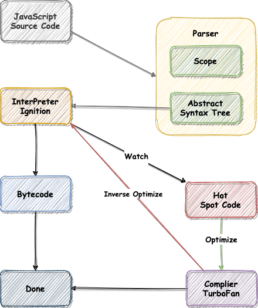

## JavaScript Object

JavaScript 是一门 **基于对象(Object-Based)** 的语言，可以说 JavaScript 中除了 `null`，`undefined`  之类的特殊表示外大部分的内容都是由对象构成的，我们甚至可以说 JavaScript
是建立在对象之上的语言。

但是 JavaScript 从严格上讲并不是一门面向对象的语言，这也是因为面向对象语言需要天生支持封装、继承、多态。但是 JavaScript 并没有直接提供多态支持，但是我们还是可以实现多态，只是实现起来还是较为麻烦。

JavaScript 的对象结构很简单，由一组建和值构成，其中值可以由三种类型：

- 原始类型：原始类型主要包括：null、undefined、boolean、number、string、bigint、symbol，以类似栈数据结构存储，遵循先进后出的原则，而且具有 `immutable` 特点，比如我们修改了 `string` 的值，V8 会返回给我们一个全新的 `string`。
- 对象类型：JavaScript 是建立在对象之上的语言，所以对象的属性值自然也可以是另一个对象。
- 函数类型：如果函数作为对象的属性，我们一般称其为方法。

### Function

函数作为 JavaScript 中的一等公民，它能非常灵活的实现各种功能。其根本原因是 JavaScript 中的函数就是一种特殊的对象。正因为函数是一等公民的设计，我们的 JavaScript 可以非常灵活的实现闭包和函数式编程等功能。

函数可以通过函数名称加小括号进行调用：

```JavaScript
function foo(obj) {
  const bar = obj.foo + 1
  return bar + '1'
}

foo({foo: 1});
```

也可以使用匿名函数，`IIFE` 方式调用，实际上 `IIFE` 方式只支持接收表达式，但是下例的函数是语句，因此 V8 会隐性地把函数语句 `foo` 理解成函数表达式 `foo`，从而运行。

> 在 ES6 出现模块作用域之前，JavaScript 中没有私有作用域的概念，因此在多人开发项目的时候，常常会使用单例模式，以 IIFE 的模式创建一个 namespace 以减少全局变量命名冲突的问题。因此 IIFE 最大的特点是执行不会污染环境，函数和函数内部的变量都不会被其他部分的代码访问到，外部只能获取到 IIFE 的返回结果。

``` javascript
(function foo(obj) {
  const bar = obj.foo + 1
  
  return bar + '1'
})({foo: 1})
```

既然函数本质是对象，那么函数是如何获得和其他对象不一样的可调用特性的呢？

V8 内部为了处理函数的可调用特性，会给每个函数加入隐藏属性，如下图所示：

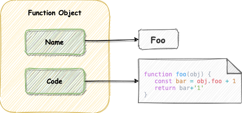

隐藏属性分别是函数的 `name` 属性和 `code` 属性。

- `name` 属性造就被浏览器广泛支持，但是直到 ES6 才将其写入标准，ES6 之前的 `name` 属性之所以可以获取到函数名称，是因为 V8 对外暴露了相应的接口。Function 构造函数返回的函数实例，name 属性的值为 `anonymous`

```javascript
(new Function).name // "anonymous"
```

- `code` 属性表示的是函数编码，以 `string` 的形式存储在内存中。当执行到一个函数调用语句时，V8 会从函数对象中取出 `code` 属性值，然后解释执行这段函数代码。 V8 没有对外暴露 `code` 属性，因此无法直接输出。

### About JavaScript

JavaScript 可以通过 `new` 关键字来生成相应的对象，不过这中间隐藏了很多细节导致很容易增加理解成本。实际上这种做法是出于对市场的研究，由于 JavaScript 的诞生时期，Java 非常的流行，而 JavaScript 需要像 Java ，但又不能和 Java 进行 battle。因此 JavaScript 不仅在名字上蹭热度，同时也加入了 new。于是构造对象变成了我们看见的样子。这在设计上又显得不太合理，但它也的确帮助推广了 JavaScript 热度。

另外 ES6 新增了 `class` 特性，但 `class` 在根源上还是基于原型链继承那一套东西，在发展历史中人们尝试在 ES4 前后为了实现真正的类而做努力，然而都失败了，因此最终决定不做真正正确的事，因此我们现在使用的 `class` 是真正意义上的 JS VM 语法糖，但这和我们在项目中使用 babel 转换成函数后再执行本质上有区别，V8 在编译类的时候会给予相应的关键字进行处理。

### Object Storage

JavaScript 是基于对象的，因此对象的值类型也非常丰富。它为我们带来灵活的同时，对象的存储数据结构用线性数据结构已经无法满足需求，得使用非线性的数据结构（字典）进行存储。这就带来了对象访问效率低下的问题。因此 V8 为了提升存储和查找效率，采用了一套复杂的存储策略。

首先我们创建对象 foo，并打印它。相关代码如下所示：

```javascript
function Foo() {
  this["bar3"] = 'bar-3'
  this[10] = 'foo-10'
  this[1] = 'foo-1'
  this["bar1"] = 'bar-1'
  this[10000] = 'foo-10000'
  this[3] = 'foo-3'
  this[0] = 'foo-0'
  this["bar2"] = 'bar-2'
}

const foo = new Foo()

for(key in bar){
  console.log(`key: ${key} value:${foo[item]}`)
}
```

代码输出的结果如下

```shell
key: 0 value:foo-0
key: 1 value:foo-1
key: 3 value:foo-3
key: 10 value:foo-10
key: 10000 value:foo-10000
key: bar3 value:bar-3
key: bar1 value:bar-1
key: bar2 value:bar-2
```

仔细观察后，可以发现 V8 隐式处理了对象的排列顺序

- `key` 为数字的属性被优先打印，并升序排列
- `key` 为字符串的属性按照被定义时的顺序进行排列。

之所以会出现这样的结果是因为 ECMAScript 规范中定义了数字属性应该按照索引值大小升序排列，字符串属性根据创建时的顺序升序排列。V8 作为 ECMAScript 的实现当然需要准守规范。

为了优化对象的存取效率，V8 通过 `key`把对象分成两类。

- 对象内 `key` 为数字的属性称为 `elements`（排序属性），此类属性通过浪费空间换取时间，直接下标访问，提升访问速度。当 element 的序号十分不连续时，会优化成为 hash 表。
- 对象内 `key` 为字符串的属性称为 `properties`（常规属性），通过把对象的属性和值分成线性数据结构和属性字典结构后，以优化原本的完全字典存储。`properties` 属性默认采用链表结构，当数据量很小时，查找也会很快，但数据量上升到某个数值后，会优化成为 hash 表。上述对象在内存中存储如图所示：

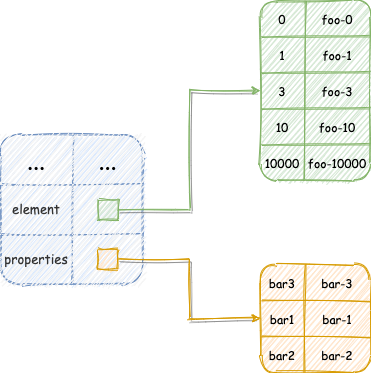

完成存储分解后，对象的存取会根据索引值的类别去对应的属性中进行查找，如果是对属性值的全量索引，那么 V8 会从 `elements` 中按升序读取元素，再去 `properties` 中读取剩余的元素。

值得注意的是 V8 对 ECMAScript 的实现是惰性的，在内存中 V8 并没有对 `element` 元素升序排列。

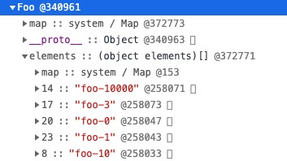

### 对象内属性

V8 将对象按属性分为两类后，简化了对象查找效率，但是也会多一个步骤，例如笔者现在需要访问 `Foo.bar3`，v8 需要先访问相应的对象 `Foo`，再访问相应的 `properties` 才能取到`bar3` 对应的值，为了简化操作， V8 会为对象的 `properties` 属性默认分配 10 个对象内属性（in-object properties）如下图所示：

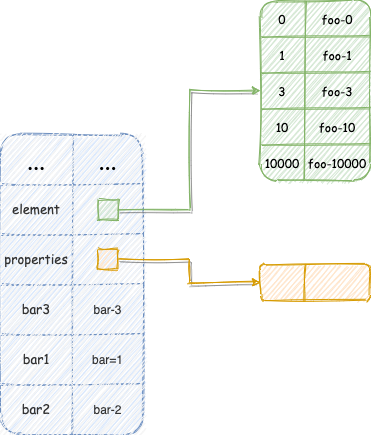

当 `properties` 属性不足 10 个时，所有的 `properties` 属性均可以成为对象内属性，当超过 10 个时，**超过 10** 的`properties`属性，重新回填到`properties`中采用字典结构进行存储。使用对象内属性后，再次查找对应的属性就方便多了。

> 对象内属性是可以动态扩充的。 The number of in-object properties is predetermined by the initial size of the object。但笔者目前没有见到对象内属性通过动态扩容大于 10 个的情况。

分析到这里，同学们可以思考下日常开发中有哪些操作会非常不利于以上规则的实现效率，比如 `delete` 在一般情况下是不建议使用的，它对于对象属性值的操作，因为删除元素后会造成大量的属性元素移动，而且`properties`也可能需要重排到对象内属性，均为额外性能的开销；在**不影响代码语义流畅性**的情况下，可以使用 `undefined` 进行属性值的重设置，或者使用 `Map` 数据结构，`Map.delete` 的优化较优。

对象内属性不适用于所有场景，在对象属性过多或者对象属性被频繁变更的情况下， V8 会取消对象内属性的分配，全部降级为非线性的字典存储模式，这样虽然降低了查找速度，但是却提升了修改对象的属性的速度。例如：

```javascript
function Foo(_elementsNum, _propertiesNum) {
  // set elements
  for (let i = 0; i < _elementsNum; i++) {
    this[i] = `element${i}`;
  }
  // set property
  for (let i = 0; i < _propertiesNum; i++) {
    let ppt = `property${i}`;
    this[ppt] = ppt + 'value';
  }
}
const foos = new Foo(100, 100);
```

实例化 `foos` 对象后，我们观察对应内存的 `properties`，可以发现所有的 `property${i}` 属性都在 `properties` 中，因为数量过多已经被 V8 已经降级处理。

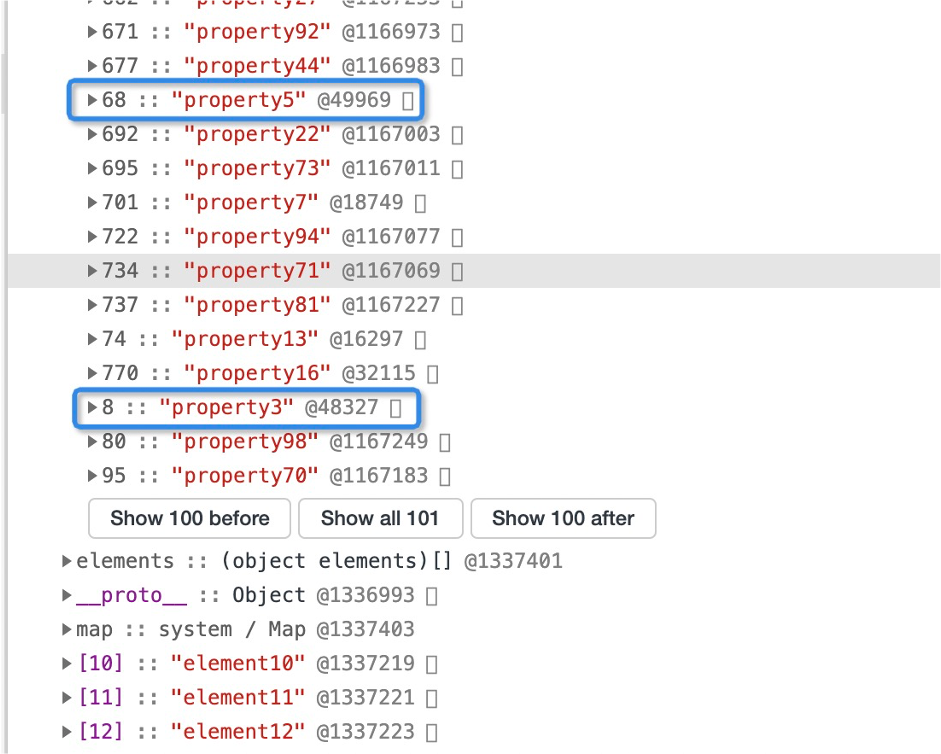

#### 编译器优化

以上文的代码为例，我们再创建一个更大的对象实例

```javascript
const foos = new Foo(10000, 10000);
```

由于我们创建对象的构造函数是固定的结构，因此理论上会触发监控器标记热点代码，交给编译器进行对应的优化，我们来看看 V8 的输出记录

```javascript
[marking 0x2ca4082d26e5 <JSFunction Foo (sfi = 0x2ca4082d25f5)> for optimized recompilation, reason: small function]
[compiling method 0x2ca4082d26e5 <JSFunction Foo (sfi = 0x2ca4082d25f5)> (target TURBOFAN) using TurboFan OSR]
[optimizing 0x2ca4082d26e5 <JSFunction Foo (sfi = 0x2ca4082d25f5)> (target TURBOFAN) - took 1.135, 3.040, 0.287 ms]
[marking 0x2ca4082d26e5 <JSFunction Foo (sfi = 0x2ca4082d25f5)> for optimized recompilation, reason: small function]
[compiling method 0x2ca4082d26e5 <JSFunction Foo (sfi = 0x2ca4082d25f5)> (target TURBOFAN) using TurboFan OSR]
[optimizing 0x2ca4082d26e5 <JSFunction Foo (sfi = 0x2ca4082d25f5)> (target TURBOFAN) - took 0.596, 1.681, 0.050 ms]
```

可以看见确实输出了对应的优化记录，但笔者没有对其进行更深入的研究，若有同学知道更多关于编译器优化的细节，可以在评论区补充。

#### 关于 \_proto_

JavaScript 的继承非常有特点，是使用原型链的方式进行继承，用 `_proto_` 作为链接的桥梁。但是 V8 内部是非常不建议直接使用 `_proto_` 直接操作对象的继承，因为这涉及到 V8 隐藏类相关，会破坏 V8 在对象实例生成时已经做好的隐藏类优化与相应的类偏移（class transition）操作。

## JavaScript 类型系统

JavaScript 中的类型系统是非常基础的知识点，但它也是被应用地最广泛灵活，情况复杂且容易出错的，主要原因在于类型系统的转换规则繁琐，且容易被工程师们忽视其重要性。

在 CPU 中对数据的处理只是移位，相加或相乘，没有相关类型的概念，因为它处理的是一堆二进制代码。但在高级语言中，语言编译器需要判断不同类型的值相加是否有相应的意义。

例如同 JavaScript 一样是弱类型语言的 python 输入以下代码 `1+'1'`

```python
In[2]: 1+'1'

Traceback (most recent call last):
  File "..", line 1, in run_code
    exec(code_obj, self.user_global_ns, self.user_ns)
  File "<ipython-input-2-0cdad81f9201>", line 1, in <module>
    1+'1'
TypeError: unsupported operand type(s) for +: 'int' and 'str'
```

可以看见抛出对应 `TypeError` 的错误，但是这段代码在 JavaScript 中不会报错，因为这被认为是有意义的代码。

```javascript
console.log(1+'1')
// 11
```

造成上述现象结果的内在是类型系统。类型系统越强大，那编译器能够检测的内容范围也越大。它能影响的不只是类型的定义，还有对于类型的检查，以及不同类型之前操作交互的定义。

> 在维基百科中，类型系统是这样定义的：在计算机科学中，类型系统（type system）用于定义如何将编程语言中的数值和表达式归类为许多不同的类型，如何操作这些类型，这些类型如何互相作用。类型可以确认一个值或者一组值具有特定的意义和目的（虽然某些类型，如抽象类型和函数类型，在程序运行中，可能不表示为值）。类型系统在各种语言之间有非常大的不同，也许，最主要的差异存在于编译时期的语法，以及运行时期的操作实现方式。

### 类型系统基本转换

[ECMAScript](https://262.ecma-international.org/6.0/#sec-addition-operator-plus-runtime-semantics-evaluation) 定义了 JavaScript 中具体的运算规则。

```shell
1.Let lref be the result of evaluating AdditiveExpression.
2.Let lval be GetValue(lref).
3.ReturnIfAbrupt(lval).
4.Let rref be the result of evaluating MultiplicativeExpression.
5.Let rval be GetValue(rref).
6.ReturnIfAbrupt(rval).
7.Let lprim be ToPrimitive(lval).
8.ReturnIfAbrupt(lprim).
9.Let rprim be ToPrimitive(rval).
10.ReturnIfAbrupt(rprim).
11.If Type(lprim) is String or Type(rprim) is String, then
    a.Let lstr be ToString(lprim).
    b.ReturnIfAbrupt(lstr).
    c.Let rstr be ToString(rprim).
    d.ReturnIfAbrupt(rstr).
    e.Return the String that is the result of concatenating lstr and rstr.
12.Let lnum be ToNumber(lprim).
13.ReturnIfAbrupt(lnum).
14.Let rnum be ToNumber(rprim).
15.ReturnIfAbrupt(rnum).
16.Return the result of applying the addition operation to lnum and rnum. See the Note below
```

规则比较复杂，我们慢慢分解进行介绍。以加法为例，先来看看标准类型，如果是数字和字符串进行相加，其中只要出现字符串，V8 会处理其他值也变成字符串，例如：

```javascript
const foo = 1 + '1' + null + undefined + 1n

// 表达式被 V8 转换为
const foo = Number(1).toString() + '1' + String(null) + String(undefined) + BigInt(1n).toString()

// "11nullundefined1"
```

如果参与运算的内容并不是基础类型，根据 ECMAScript 规范来看，V8 实现了一个 `ToPrimitive` 方法，其作用是把复合类型转换成对应的基本类型。
`ToPrimitive` 会根据对象到字符串的转换或者对象到数字的转换，拥有两套规则

```typescript
type NumberOrString = number | string

type Check<T> = 

type PrototypeFunction<Check> = (input: Record<string, any>, flag:T) => T

type ToPrimitive = PrototypeFunction<NumberOrString>
```

从上述 `TypeScript` 类型可以得知，虽然对象都会使用 `ToPrimitive` 进行转换，但根据第二个参数的传参不同，最后的处理也会有所不同。
下面会给出不同参数所对应的 `ToPrimitive` 处理流程图：

对应 ToPrimitive(object, Number)，处理步骤如下：

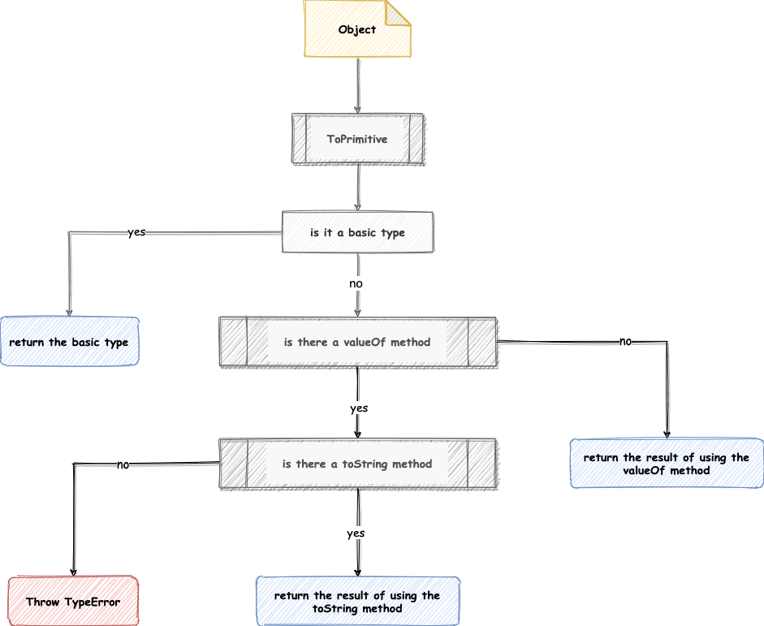

- 如果 object 为基本类型，直接返回结果
- 否则，调用 valueOf 方法，如果返回一个原始值，则 JavaScript 将其返回。
- 否则，调用 toString 方法，如果返回一个原始值，则 JavaScript 将其返回。
- 否则，JavaScript 抛出一个 `TypeError` 异常。

对应 ToPrimitive(object, String)，处理步骤如下：

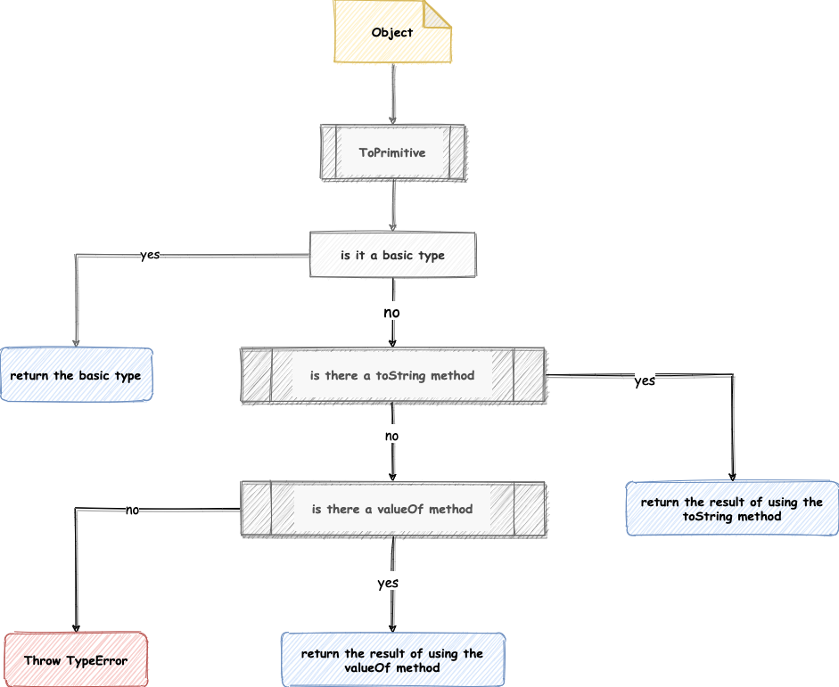

- 如果 object 为基本类型，直接返回结果
- 否则，调用 toString 方法，如果返回一个原始值，则 JavaScript 将其返回。
- 否则，调用 valueOf 方法，如果返回一个原始值，则 JavaScript 将其返回。
- 否则，JavaScript 抛出一个 `TypeError` 异常。

其中 `ToPrimitive` 的第二个参数是非必填的，默认值为 `number` 但是 `date` 类型是例外，默认值是 `string`。

下面我们来看几个例子，验证一下：

```javascript
/*
例一
*/
{ foo: 'foo' } + { bar: 'bar' }
// "[object Object][object Object]"

/*
例二
*/
{
  foo: 'foo',
  valueOf() {
    return 'foo';
  },
  toString() {
    return 'bar';
  },
} +
{
  bar: 'bar',
  toString() {
    return 'bar';
  },
}
// "foobar"

/*
例三
*/
{
  foo: 'foo',
  valueOf() {
    return Object.create(null);
  },
  toString() {
    return Object.create(null);
  },
} +
{
  bar: 'bar',
}
// Uncaught TypeError: Cannot convert object to primitive value

/*
例四
*/
const date = new Date();
date.valueof = () => '123';
date.toString = () => '456';
date + 1;
// "4561"
```

其中例三会报错，因为 `ToPrimitive` 无法转换成基础类型。

## 总结

利用 V8 深入理解 JavaScript，这个标题可能起的有点狂，但对于笔者来说通过对此学习确实更进一步理解了 JavaScript 甚至其他语言的工作机制，同时对前端和技术栈等概念有了更深层次的思考。

本文主要通过日常简单的代码存储引出 V8 相关以及计算机科学的一些概念，从 JavaScript 的定位推导出当前设计的原因，以及结合 V8 工作流程给出一个宏观的认识；接着通过详细的步骤完整的展现了 V8 编译流水线每个环节的产物；通过分析 JavaScript 对象引出其存储规则；最后通过类型系统引出 V8 对不同类型数据进行交互的规则实现。

对于 V8 庞大而复杂的执行结构来说本文只阐述了凤毛麟角，文中有太多的话题可以用来延伸引出更多值得研究的学问，希望同学们通过本文可以有所收获和思考，如果文中有错误欢迎在评论区指出。

## 参考资料

- [Concurrent marking in V8](https://v8project.blogspot.com/2018/06/concurrent-marking.html)
- [How JavaScript works: inside the V8 engine + 5 tips on how to write optimized code](https://blog.sessionstack.com/how-javascript-works-inside-the-v8-engine-5-tips-on-how-to-write-optimized-code-ac089e62b12e)
- [维基百科-类型系统](https://zh.wikipedia.org/wiki/%E9%A1%9E%E5%9E%8B%E7%B3%BB%E7%B5%B1)
- [ECMAScript® 2015 Language Specification](https://262.ecma-international.org/6.0/#sec-addition-operator-plus-runtime-semantics-evaluation)
- [ECMAScript](https://tc39.es/ecma262/#sec-toprimitive)
- [Understanding V8’s Bytecode](https://medium.com/dailyjs/understanding-v8s-bytecode-317d46c94775)
- [用字节码包含 node.js 源码之原理篇](https://zhuanlan.zhihu.com/p/359235114)